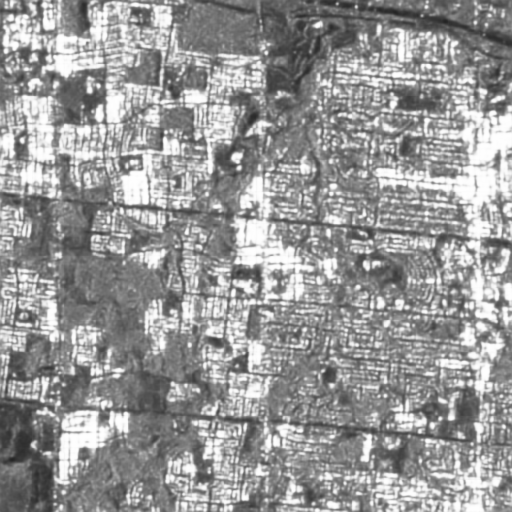
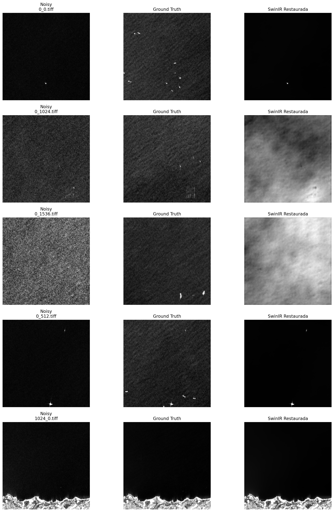
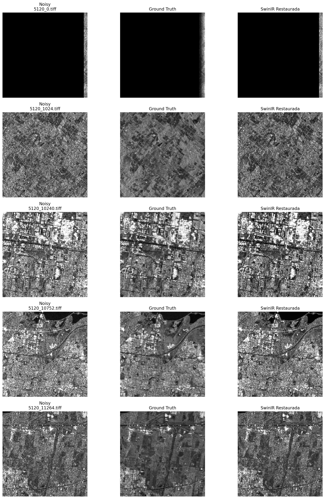

# Informe de Proyecto: Aprendizaje Profundo e IA Generativa

**Institución:** Politécnico Colombiano Jaime Isaza Cadavid
**Asignatura:** Visión por computador e Inteligencia Artificial
**Guía Práctica:** 4

---

## 1. Introducción y Contexto de Estudio

El procesamiento avanzado de imágenes mediante técnicas de Aprendizaje Profundo (Deep Learning) e Inteligencia
Artificial Generativa ha revolucionado la visión por computador. A diferencia de las metodologías clásicas de
aprendizaje automático (Machine Learning), las arquitecturas profundas permiten extraer jerarquías de características
visuales complejas directamente de los píxeles. Sin embargo, su desempeño depende drásticamente de la arquitectura
elegida, el tamaño del conjunto de datos y la naturaleza del dominio de las imágenes.

Este documento presenta el desarrollo y los resultados de la **Guía Práctica 4**. El proyecto explora y contrasta el
rendimiento de arquitecturas secuenciales (entrenadas desde cero) frente a modelos no secuenciales con transferencia de
aprendizaje (como ResNet50) en tareas de clasificación. Posteriormente, se evalúa la eficacia de arquitecturas
generativas y Transformers (Autoencoders y SwinIR) para la mitigación del ruido multiplicativo *speckle* en imágenes de
Radar de Apertura Sintética (SAR).

### Objetivos y Retos del Proyecto

Para abordar el estudio de estas arquitecturas, el informe documenta la solución de los siguientes cuatro retos:

1. **Reto 1 — Clasificación de 3 escenas:** Comparativa entre una CNN secuencial y ResNet50 sobre un dataset de
   paisajes.
2. **Reto 2 — Clasificación LandUse:** Análisis de rendimiento de modelos profundos sobre texturas de cobertura
   terrestre.
3. **Reto 3 — Autoencoder para reducción de speckle:** Implementación de una red codificadora-decodificadora para
   restaurar imágenes SAR.
4. **Reto 4 — Restauración con Transformer (SwinIR):** Evaluación de un modelo generativo preentrenado sobre el dominio
   de radar.

---

## 2. Reto 1: Clasificación de 3 escenas (coast, forest, highway)

### Procedimiento Implementado

Para la tarea de clasificar imágenes en tres escenas específicas (*coast*, *forest*,
*highway*), en este reto se implementaron dos enfoques: una CNN secuencial entrenada desde cero
y una arquitectura no secuencial basada en ResNet50 con transferencia de aprendizaje.

### Análisis de Resultados

* **CNN Secuencial:** La CNN secuencial presentó problemas de generalización. Aunque
  alcanzó valores cercanos al 99% en entrenamiento, su desempeño en validación fue bajo (alrededor del 52%),
  evidenciando sobreajuste. Además, en algunas ejecuciones mostró colapso hacia una sola clase,
  lo que indica inestabilidad del modelo.
* **ResNet50 (Transfer Learning):** En contraste, ResNet50 obtuvo resultados sobresalientes, alcanzando
  aproximadamente 99.58% de accuracy con imágenes de 224x224. Esto demuestra que la
  transferencia de aprendizaje permite capturar características visuales más complejas y generalizar mejor con datasets
  limitados.

*(Para revisar las matrices de confusión y el reporte de clasificación exacto, dirigirse a la
carpeta `./OneExercise/evidence/`)*.

### Conclusión del Reto 1

Las arquitecturas no secuenciales preentrenadas son significativamente superiores a las CNN entrenadas desde
cero en este tipo de problema.

---

## 3. Reto 2: Clasificación LandUse (airplane, denseresidential, harbor)

### Procedimiento Implementado

En este reto se aplicó el mismo enfoque sobre el dataset LandUse con tres clases
específicas : *airplane*, *denseresidential* y *harbor*. El objetivo fue evaluar si
los patrones de comportamiento de los modelos observados en el Reto 1 se mantenían al cambiar el dominio a texturas de
cobertura terrestre.

### Análisis de Resultados

* La CNN secuencial volvió a presentar problemas importantes, incluyendo colapso hacia una sola clase (
  *airplane*), incluso después de aplicar técnicas como reducción del learning rate y uso de pesos de clase.
* Esto evidencia que el modelo es inestable y sensible al dataset cuando se entrena desde cero.
* Las causas principales incluyen el tamaño limitado del dataset, la variabilidad entre clases y la ausencia
  de conocimiento previo en el modelo.

### Conclusión del Reto 2

La CNN secuencial no es adecuada para este escenario, y nuevamente el uso de transferencia de aprendizaje
representa la solución más robusta.

---

## 4. Reto 3: Autoencoder para reducción de speckle

### Procedimiento Implementado

Se implementó un autoencoder convolucional para reducir ruido speckle en imágenes SAR, utilizando pares de
imágenes noisy como entrada y gtruth como referencia. Se calcularon métricas de calidad de imagen para
evaluar objetivamente la capacidad de la red para restaurar la señal original.

**Ejemplo de imagen filtrada obtenida por el Autoencoder:**


*(Nota: Más resultados visuales disponibles en el directorio `evidence/filtered_tiff`)*.

### Resultados Cuantitativos

| Métrica  | Imagen Noisy (Entrada) | Imagen Autoencoder (Salida) | Ground Truth (Referencia) |
|:---------|:-----------------------|:----------------------------|:--------------------------|
| **PSNR** | 25.80                  | 22.66                       | -                         |
| **SSIM** | 0.859                  | 0.824                       | -                         |
| **ENL**  | 0.603                  | 0.594                       | 0.586                     |

### Análisis de Resultados

* Las métricas muestran que el autoencoder no logró mejorar la calidad de las imágenes.
* Tanto el PSNR como el SSIM disminuyeron, lo que indica que la imagen reconstruida se alejó del ground
  truth.
* El ENL tampoco presentó una mejora significativa.
* Este comportamiento puede explicarse por una arquitectura limitada, el uso de una función de pérdida no
  óptima y la posible pérdida de detalles debido al suavizado excesivo.

### Conclusión del Reto 3

El autoencoder no logró eliminar el ruido speckle de manera efectiva y requiere ajustes en arquitectura,
función de pérdida y proceso de entrenamiento.

---

## 5. Reto 4: Restauración con Transformer (SwinIR)

### Procedimiento Implementado

En este reto se aplicó SwinIR, un modelo basado en Transformer, utilizando imágenes noisy como entrada y
comparando contra gtruth. Este enfoque busca aprovechar los mecanismos de autoatención para la
reconstrucción de imágenes.

**Comparativa Visual SwinIR (Base GAR):**


### Caso de Estudio 2: Dataset SAR de Alta Degradación (`FourExerciseSAR`)

En este entorno altamente ruidoso, SwinIR fue puesto a prueba bajo condiciones extremas. Las métricas indicaron una
caída leve en el PSNR (de 19.91 a 19.64). Esto ocurre debido al **Domain Shift**: SwinIR fue preentrenado con imágenes
naturales (ópticas), por lo que no comprende matemáticamente la naturaleza multiplicativa del ruido *speckle* en
microondas.

**Comparativa Visual SwinIR (Dataset SAR):**


### Resultados Cuantitativos

| Métrica  | Imagen Noisy (Entrada) | Imagen SwinIR (Salida) | Ground Truth (Referencia) |
|:---------|:-----------------------|:-----------------------|:--------------------------|
| **PSNR** | 19.91                  | 19.64                  | -                         |
| **SSIM** | 0.623                  | 0.611                  | -                         |
| **ENL**  | 25.57                  | 23.61                  | 91.87                     |

### Análisis de Resultados

* Los resultados obtenidos evidencian que SwinIR no mejoró la calidad de las imágenes, sino que las degradó
  ligeramente.
* La causa principal es que el modelo fue preentrenado con imágenes naturales y no está adaptado al dominio
  SAR ni al ruido speckle.

### Conclusión del Reto 4

Aunque SwinIR cumple con el uso de modelos basados en Transformer, no generaliza adecuadamente a imágenes
SAR sin un ajuste específico al dominio.

---

## 6. Conclusiones Finales del Proyecto

El desarrollo de esta guía práctica ha permitido comprobar empíricamente los desafíos del diseño y entrenamiento de
arquitecturas profundas aplicadas a la visión por computador:

* **Superioridad del Transfer Learning en Clasificación:** En dominios donde los datos son limitados o altamente
  variables (como *3 scenes* o *LandUse*), entrenar redes convolucionales secuenciales desde cero conduce a
  inestabilidad, colapso de clases y sobreajuste severo. Los modelos con transferencia de aprendizaje (ResNet50)
  demuestran ser la estrategia óptima y más robusta.
* **El Reto de la Restauración en el Dominio SAR:** Las tareas de reducción de ruido *speckle* resultaron altamente
  complejas. Ni un autoencoder básico diseñado desde cero, ni un Transformer avanzado (SwinIR) preentrenado en imágenes
  ópticas, lograron acercarse a la calidad del *Ground Truth*. Esto subraya que los modelos generativos requieren
  arquitecturas específicamente diseñadas y un reentrenamiento riguroso (fine-tuning) orientado a la naturaleza física
  del radar de apertura sintética para no degradar las métricas de evaluación objetiva (PSNR, SSIM, ENL).

---

## 7. Estructura del Repositorio e Instrucciones de Ejecución

El proyecto se encuentra modularizado por carpetas correspondientes a cada reto, separando claramente los *datasets*,
los cuadernos de Jupyter (*Notebooks*) y las evidencias generadas (modelos entrenados y métricas).

### Estructura de Archivos

```text
CV_GuideFour/
│
├── RETO1/
│   ├── 3scenes/                  # Dataset con clases: coast, forest, highway
│   ├── evidencias_reto1/         # Modelos (.keras), reportes y matrices de confusión (.csv)
│   └── reto1.ipynb               # Notebook: Clasificación CNN Secuencial vs ResNet50
│
├── RETO2/
│   ├── evidencias_landuse/       # Modelos (.keras) y métricas comparativas (.csv)
│   ├── landuse/                  # Dataset con clases: airplane, denseresidential, harbor
│   └── reto2.ipynb               # Notebook: Clasificación LandUse
│
├── RETO3/
│   ├── dataset/                  # Pares de parches SAR de 512x512 (gtruth/ y noisy/)
│   ├── evidencias_autoencoder/   # Modelo entrenado (.keras) y resúmenes de métricas (.csv)
│   ├── filtered_tiff/            # Resultados visuales: imágenes filtradas por el Autoencoder
│   └── reto3.ipynb               # Notebook: Autoencoder para reducción de speckle
│
├── RETO4/
│   ├── dataset/                  # Pares de parches SAR de 512x512 (gtruth/ y noisy/)
│   ├── evidencias_swinir/        # Métricas (.csv) y gráfica de comparación visual (.png)
│   ├── restored_tiff/            # Resultados visuales: imágenes restauradas por SwinIR
│   └── reto4.ipynb               # Notebook: Restauración de imágenes con Transformer
│
└── dataset/
    └── Main folder/              # Dataset SAR crudo (GTruth, GTruth_val, Noisy, Noisy_val)
```

### Manejo de Archivos Grandes (Git LFS)

Debido a la naturaleza de este proyecto, los modelos exportados en formato `.keras` y las miles de imágenes en alta
resolución (`.tiff` y `.png`) superan los límites de tamaño estándar permitidos por los repositorios de Git
convencionales.

Para solucionar esto y mantener el historial de versiones limpio y comprimido, este repositorio implementa **Git Large
File Storage (Git LFS)**.

### ¿Cómo ejecutar este proyecto?

Para poder ejecutar los cuadernos y tener acceso a todos los pesos de los modelos y datasets de imágenes, sigue estos
pasos:

1. **Clonar el repositorio:**
   ```bash
   git clone <url-del-repositorio>
   cd CV_GuideFour
   ```

2. **Descargar los archivos pesados mediante Git LFS:**
   Es obligatorio inicializar Git LFS y forzar la descarga de los punteros reales de los archivos grandes (modelos y
   datasets). De lo contrario, los archivos `.tiff` y `.keras` estarán corruptos.
   ```bash
   git lfs install
   git lfs pull
   ```

3. **Crear y activar el entorno virtual:**
   ```bash
   python -m venv .venv
   # En Windows:
   .venv\Scripts\activate
   # En macOS/Linux:
   source .venv/bin/activate
   ```

4. **Instalar las dependencias:**
   Asegúrate de contar con TensorFlow, scikit-learn, OpenCV y las librerías de soporte instalando el archivo de
   requerimientos:
   ```bash
   pip install -r requirements.txt
   ```