# Informe de Proyecto: Teledetección con Radar (Sentinel-1)

**Institución:** Politécnico Colombiano Jaime Isaza Cadavid
**Asignatura:** Visión por computador e Inteligencia Artificial
**Guía Práctica:** 3 (Parcial 1)

---

## 1. Introducción y Contexto de Estudio

La teledetección mediante Radar de Apertura Sintética (SAR) es una herramienta poderosa que permite observar la
superficie terrestre independientemente de las condiciones climáticas o la iluminación solar. Sin embargo, el
procesamiento de estas imágenes presenta un desafío inherente: la presencia de un ruido multiplicativo conocido como
*speckle*, el cual dificulta la interpretación visual y la segmentación automática.

Este documento presenta el desarrollo y los resultados de la **Guía Práctica 3** de la asignatura Visión por Computador
e Inteligencia Artificial. El objetivo del proyecto es implementar un *pipeline* completo de visión por computador sobre
una secuencia temporal de 10 imágenes satelitales SAR (misión Sentinel-1, polarización VV).

### Zona de Estudio: Base General Alemán Ramírez (Base GAR)

Para cumplir con el criterio principal de la práctica, se seleccionó como área de interés la zona costera de la **Base
General Alemán Ramírez (Base GAR)** y sus cuerpos hídricos adyacentes. Esta ubicación geográfica es ideal para el
análisis espacial con radar, ya que ofrece un alto contraste dieléctrico y morfológico entre el océano, la accidentada
línea costera y las densas estructuras urbanas/militares contiguas.

A continuación, se presenta la imagen óptica (Color Verdadero) de la región seleccionada, capturada por el satélite
Sentinel-2, para facilitar la interpretación de las coberturas terrestres durante el análisis de las imágenes de radar:

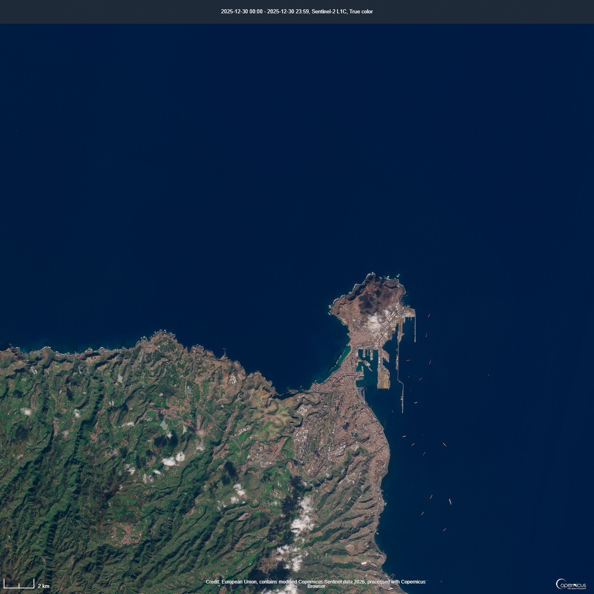
*Figura 1: Vista óptica en Color Verdadero (Sentinel-2 L1C) de la región de interés, destacando el cuerpo de agua y el
entorno urbano de la Base GAR.*

#### Análisis Óptico Complementario (Índices Multiespectrales)

Para complementar la validación del terreno (Ground Truth) y comprender mejor las firmas de las coberturas presentes
antes de aplicar los algoritmos de agrupamiento (*Clustering*), se extrajeron diversos índices y composiciones
multiespectrales de la misma fecha:

|                                                            Composición / Índice                                                             |                                                      Composición / Índice                                                      |
|:-------------------------------------------------------------------------------------------------------------------------------------------:|:------------------------------------------------------------------------------------------------------------------------------:|
| **Color Natural Optimizado** <br> 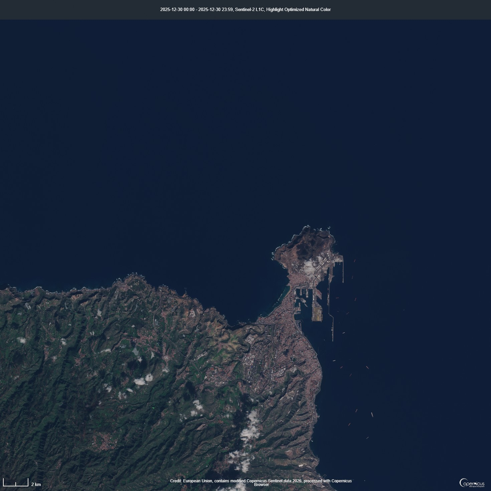 | **Falso Color (Urbano)** <br> .jpg) |
|                **Falso Color** <br> 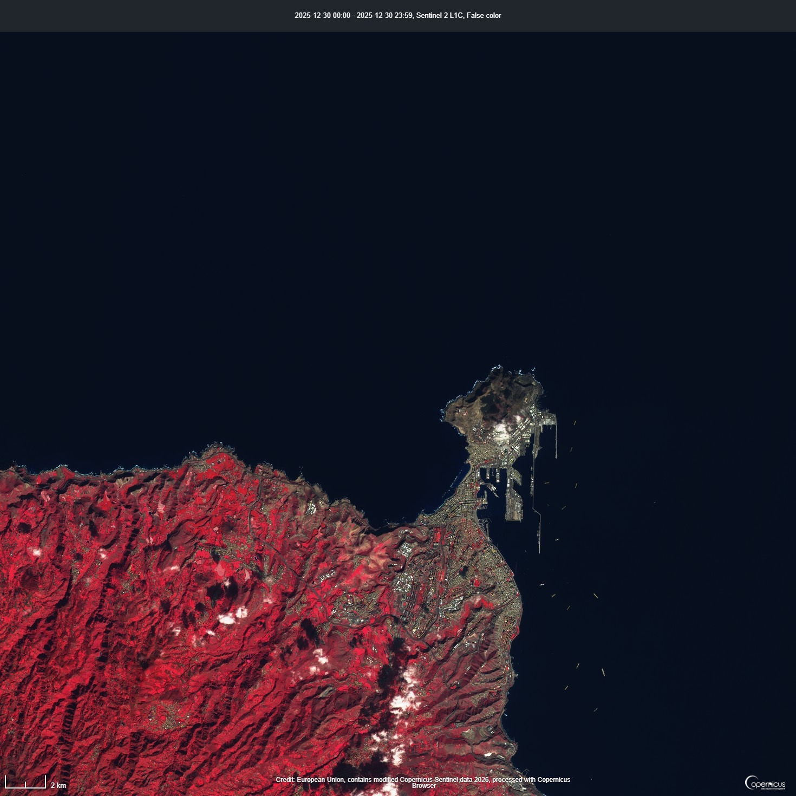                 |       **SWIR (Infrarrojo de Onda Corta)** <br> 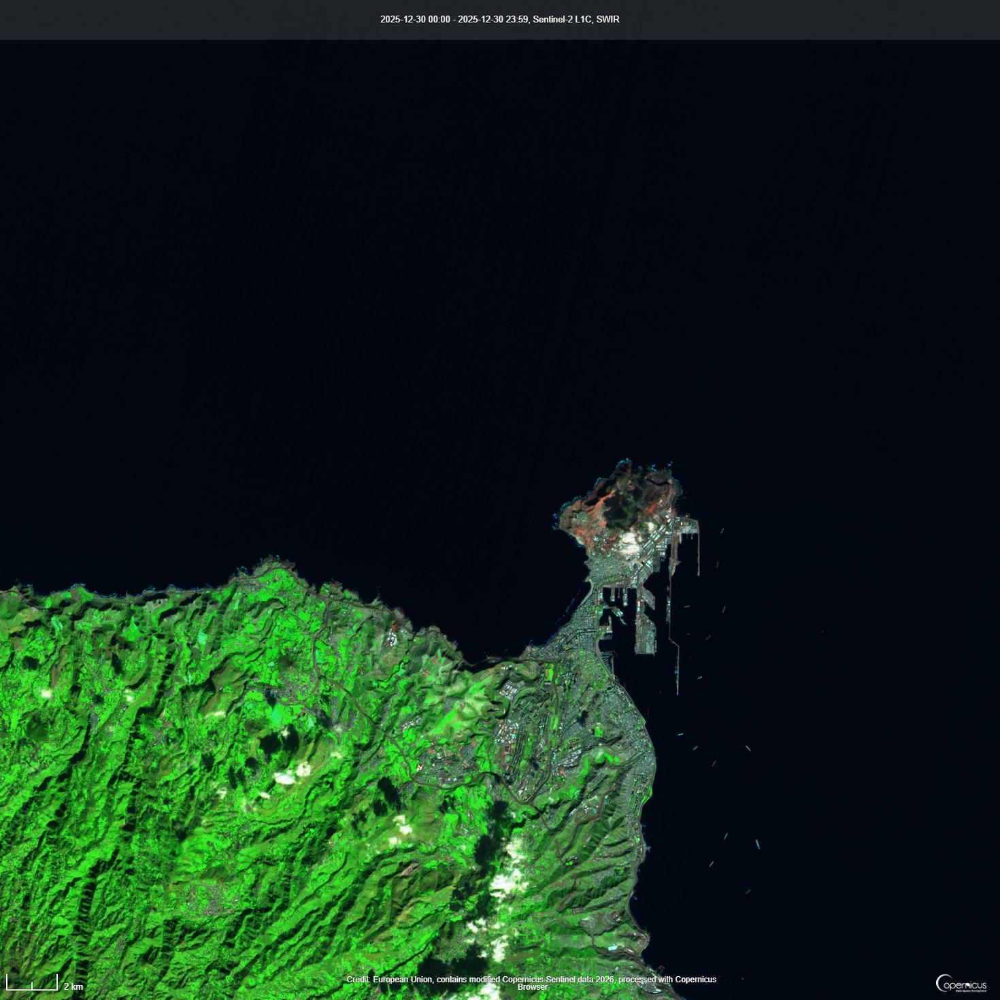       |
|                    **NDVI (Vegetación)** <br> 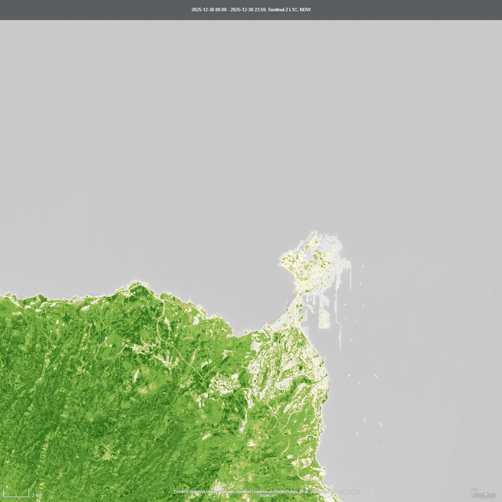                     |                 **NDWI (Agua)** <br> 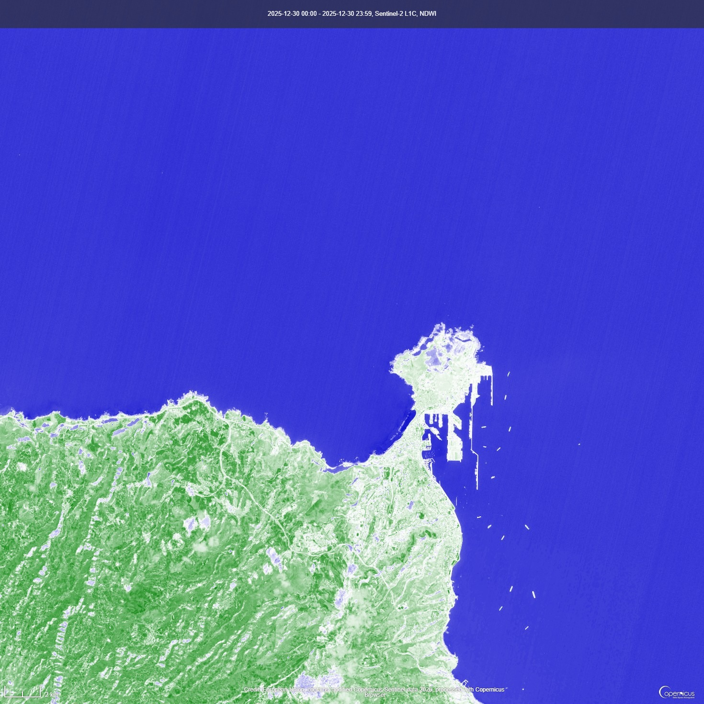                 |
|             **Índice de Humedad** <br> 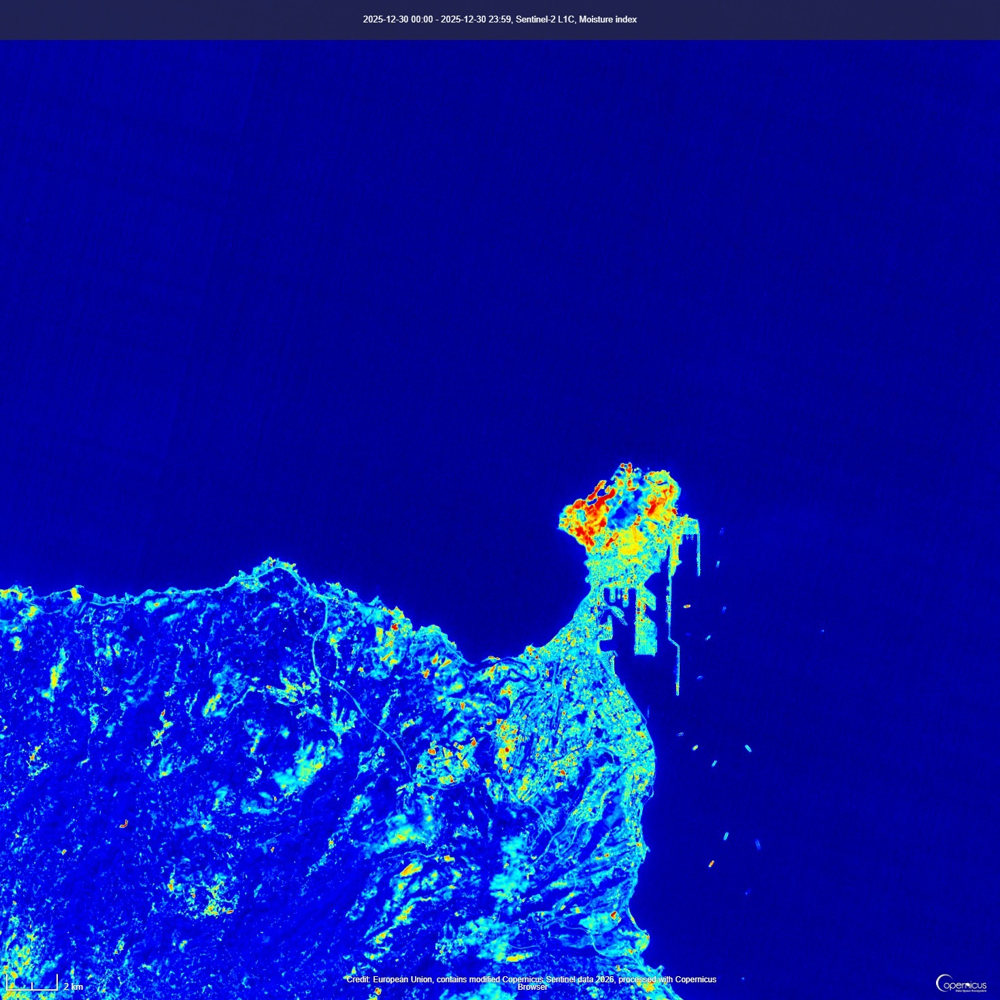              |             **NDSI (Nieve/Hielo)** <br> 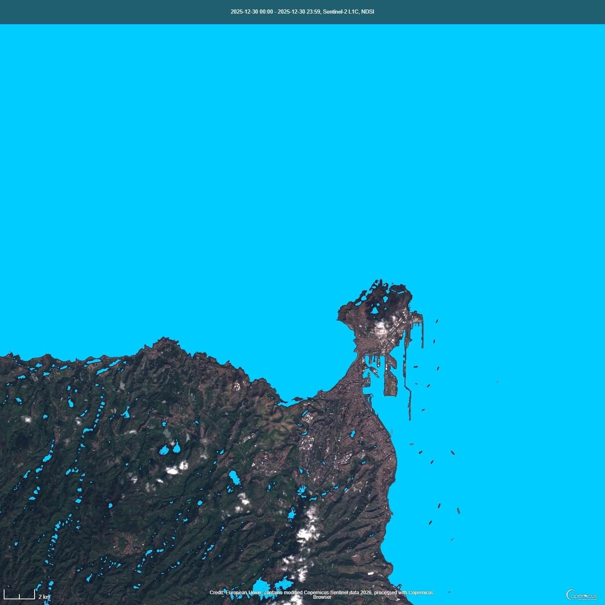              |

### Objetivos y Retos del Proyecto

Para abordar el procesamiento de esta escena, el informe documenta la solución de los siguientes cuatro retos
secuenciales:

1. **Reto de Imágenes y Filtrado:** Rescalizado de las intensidades del radar para su correcta visualización y
   aplicación del Filtro local de Lee para la mitigación del ruido *speckle*.
2. **Reto de Clasificación No Supervisada:** Segmentación de las coberturas de la escena (agua, vegetación,
   edificaciones) utilizando el algoritmo de agrupamiento K-Means, evaluando el impacto directo del filtrado previo en
   la calidad de los clústeres.
3. **Reto de Clasificación Agua/No Agua:** Binarización de los resultados del *clustering* para aislar exclusivamente
   los cuerpos hídricos y cuantificar su porcentaje de área en la imagen.
4. **Reto de Creación de Dataset:** Construcción de un conjunto de datos estructurado en parches de $512 \times 512$
   píxeles. Esto se logra mediante el registro espacial (alineación) de las 10 imágenes temporales y su promediado para
   generar un "Ground Truth" libre de ruido, creando así pares de imágenes (Noisy vs. Ground Truth) listos para entrenar
   futuros modelos de Deep Learning.

---

## 2. Reto 1: Imágenes y Filtrado

### Fundamento y Procedimiento Implementado (basado en `exercise_one.ipynb`)

El procesamiento de imágenes SAR de la misión Sentinel-1 requiere un acondicionamiento previo antes de que cualquier
algoritmo de Machine Learning pueda extraer información útil. Esto se debe a dos factores principales: el inmenso rango
dinámico de las intensidades de retrodispersión y la presencia de ruido interferométrico.

1. **Rescalizado de Intensidades:** Las imágenes SAR originales (`/raw/`) en formato *linear gamma0* poseen valores de
   intensidad con un rango dinámico muy amplio (desde valores cercanos a 0 en el agua hasta picos extremos en los
   reflectores metálicos de la base militar). Si se visualizan directamente, la imagen se vería casi completamente
   negra.
    * *Solución:* Se implementó una función que calcula la media de la imagen original y establece un límite máximo (
      `escala_display = np.mean(img2) * 3.0`). Los píxeles que superan este umbral se saturan (clipping), y el resultado
      se normaliza a una escala de 8 bits (0-255) de tipo `uint8`. Esto permite un contraste óptimo para el análisis
      visual y computacional.

2. **Filtrado de Speckle:** Las imágenes de radar no son fotografías ópticas; se forman por la emisión y recepción de
   pulsos de microondas. La interacción de estas ondas con múltiples dispersores dentro de un mismo píxel genera
   interferencias constructivas y destructivas, creando un ruido multiplicativo y determinista conocido como *speckle* (
   aspecto de "sal y pimienta"). * *Solución:* Se aplicó un **Filtro Espacial de Lee** con una ventana móvil de 7x7
   píxeles. A diferencia de un filtro de media tradicional que desenfoca toda la imagen, el Filtro de Lee es adaptativo:
   calcula la media y la varianza local en cada ventana. Si la varianza es baja (área homogénea como el mar), el filtro
   promedia agresivamente para eliminar el ruido. Si la varianza es alta (un borde costero o una zona urbana), el filtro
   conserva el valor original del píxel para no perder detalles topográficos.

### Evidencias Visuales y Análisis de Regiones de Interés (ROIs)

Para evaluar el impacto real del filtro matemático, se definieron tres Regiones de Interés (ROIs) sobre la imagen base
seleccionada, cubriendo deliberadamente diferentes tipos de coberturas y firmas radáricas:

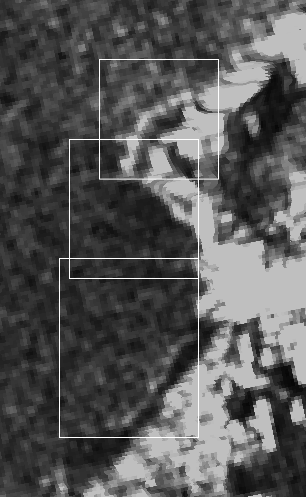

* **ROI 1 (Centro-Derecha | Puerto y Península):** Contiene alta densidad de edificaciones, la costa de La Isleta y la
  infraestructura portuaria de la Base GAR. Presenta una altísima varianza natural debido al efecto de "doble rebote" de
  la señal en las estructuras metálicas y geométricas.
* **ROI 2 (Inferior-Derecha | Mar Abierto y Zona de Fondeo):** Abarca principalmente el océano (zona naturalmente
  homogénea de baja retrodispersión), pero está salpicada por objetivos puntuales extremadamente brillantes (barcos
  fondeados). Es una zona crítica para evaluar si el filtro suaviza el mar sin "borrar" objetos pequeños.
* **ROI 3 (Inferior-Izquierda | Relieve Continental):** Abarca tierra firme con topografía accidentada y texturas
  geomorfológicas complejas (montañas y valles). Sirve para comprobar la preservación de la textura del terreno.

**Comparativa General Base:**

|            Imagen Reescalada (Sin Filtrar)             |              Imagen Filtrada (Lee)               |
|:------------------------------------------------------:|:------------------------------------------------:|
|  |  |

**Análisis del resultado visual:** Al comparar ambas imágenes, el efecto adaptativo del Filtro de Lee es evidente y
exitoso. En la **ROI 2** y el resto del océano, la textura altamente granulada (*ruido de sal y pimienta*) típica del
*speckle* disminuye notablemente, resultando en un fondo mucho más oscuro y uniforme. Sin embargo, el filtro logra
preservar la firma de los barcos fondeados sin difuminarlos excesivamente contra el mar.

Simultáneamente, en la **ROI 1**, las siluetas de los muelles y las estructuras portuarias mantienen sus bordes
definidos. En la **ROI 3**, aunque se observa una ligera reducción en la nitidez general propia del ventaneo espacial
del filtro, las crestas y valles del relieve conservan su textura estructural. Esto confirma que el filtro de Lee
cumplió su propósito: suprimir estadísticamente el ruido en áreas homogéneas mientras respeta los gradientes fuertes y
los bordes de la escena original.

### Secuencia Temporal (Imágenes Reescaladas y Filtradas)

Se procesaron 10 imágenes correspondientes a distintas fechas para observar el área bajo diferentes condiciones
temporales. A continuación, se muestran las imágenes resultantes organizadas en sus respectivas carpetas:

| Fecha / Archivo | Original Rescalada (`/scaled/`) | Filtrada con Lee (`/filtered/`) |
| :--- | :---: | :---: |
| **2025-05-01** |  |  |
| **2025-06-01** |  |  |
| **2025-07-01** |  |  |
| **2025-08-01** |  |  |
| **2025-09-01** |  |  |
| **2025-10-01** | 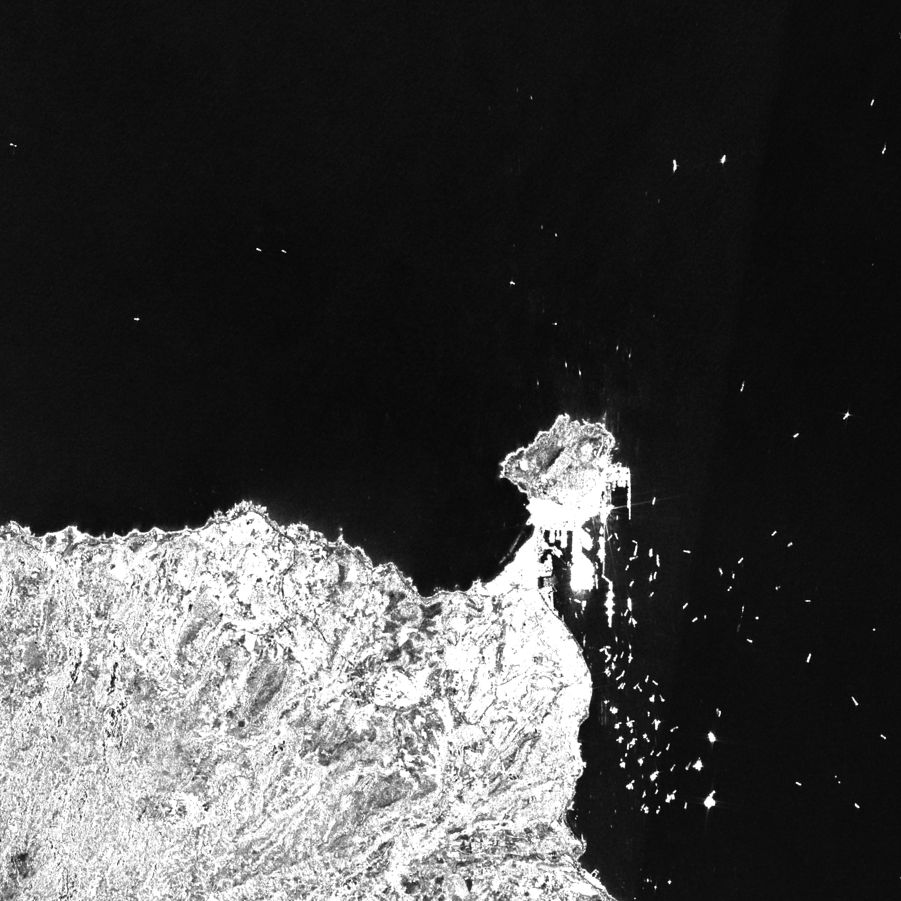 |  |
| **2025-11-01** |  | 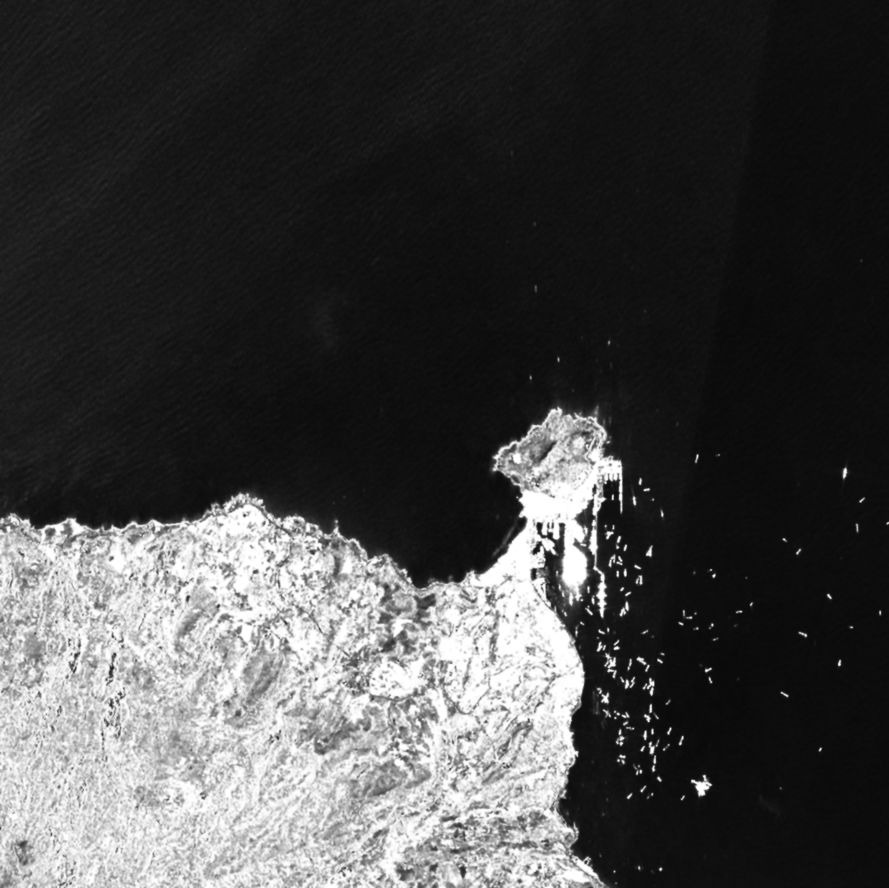 |
| **2025-12-01** |  |  |
| **2026-01-01** |  |  |
| **2026-02-01** |  |  |

*(Nota: En la secuencia temporal se puede observar que mientras las estructuras urbanas de la Base GAR mantienen una
firma de retrodispersión constantemente alta y brillante a lo largo de los meses, la intensidad del océano presenta
ligeras variaciones de gris, lo cual obedece a los cambios en la rugosidad superficial del agua provocados por el viento
y el oleaje en las distintas fechas).*

### Conclusiones del Filtrado

El código ejecutado comprobó matemáticamente la efectividad del filtro al evaluar la desviación estándar de las regiones
de interés antes y después. El Filtro de Lee cumplió satisfactoriamente su función dual: redujo drásticamente la
varianza estadística en los cuerpos hídricos (suavizando el ruido multiplicativo de radar) y conservó intactos los altos
gradientes de los contornos geográficos y urbanos. Este paso demostró ser estrictamente necesario para garantizar la
viabilidad de los algoritmos de clasificación de las siguientes etapas.

---

## 3. Reto 2: Clasificación No Supervisada

### Procedimiento Implementado (basado en `exercise_two.ipynb`)

Para automatizar la identificación de coberturas terrestres sin necesidad de datos de entrenamiento, se implementó el
algoritmo de agrupamiento no supervisado **K-Means**. Este algoritmo particiona la imagen agrupando los píxeles de tal
forma que se minimiza la varianza intra-clúster, descrita como $\sum_{i=1}^{k} \sum_{x \in S_i} ||x - \mu_i||^2$.

El procedimiento se ejecutó sobre los arreglos de píxeles unidimensionales, configurando el algoritmo para $k=3$ y $k=4$
clústeres.
Una parte fundamental de la implementación consistió en **ordenar los centroides** resultantes de menor a mayor
intensidad matemática (`np.argsort(centers)`). Al reasignarles un valor equidistante en escala de grises (0 a 255), se
garantiza que la Clase 0 (negro) siempre corresponda a la reflexión más baja (el agua) independientemente de la
inicialización aleatoria intrínseca de K-Means.

### Resultados de Agrupamiento y Análisis Comparativo

|    Configuración    |               Imagen Sin Filtrar               |            Imagen Filtrada (Lee)             |
|:-------------------:|:----------------------------------------------:|:--------------------------------------------:|
| **K-Means (k = 3)** |  |  |
| **K-Means (k = 4)** | 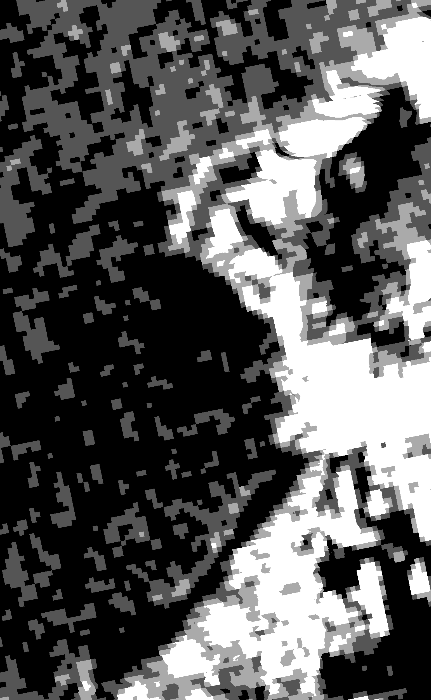 | 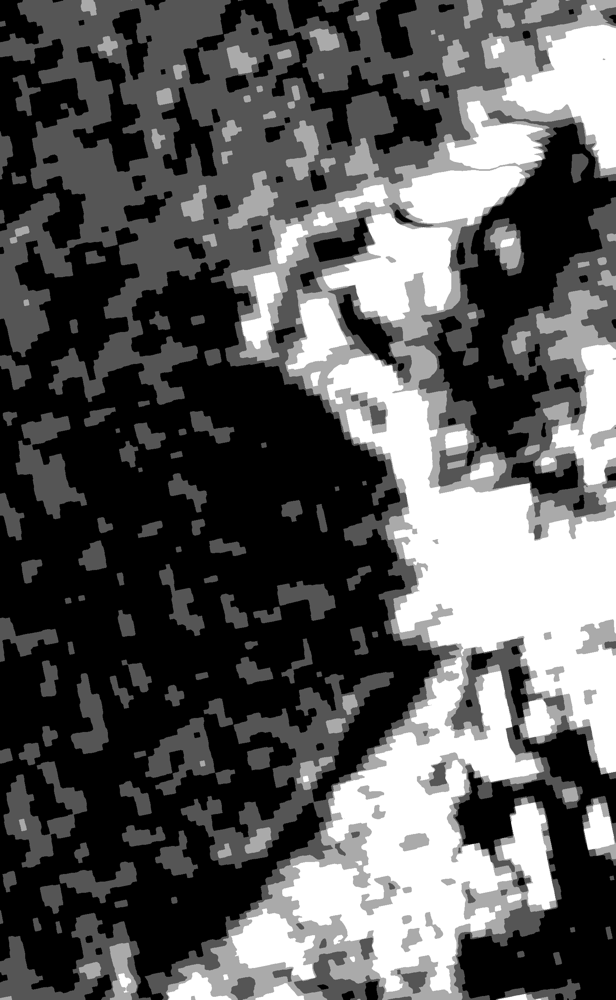 |

### Análisis Detallado de Clústeres

Al observar los resultados sobre las imágenes filtradas, se puede realizar una clara interpretación de las coberturas:

* **Modelo $k=3$ (Macro-coberturas):**
    * **Negro:** Representa el cuerpo de agua (océano/costa).
    * **Gris:** Representa las zonas de dispersión volumétrica y superficial, abarcando vegetación, arena y suelo
      desnudo.
    * **Blanco:** Representa la infraestructura humana densa (edificios de la Base GAR, estructuras metálicas y vías
      principales).
* **Modelo $k=4$ (Segmentación fina):**
  La adición de un cuarto centroide subdivide la clase terrestre intermedia en dos tonos de gris distintos. Esto permite
  que el algoritmo diferencie entre distintos niveles de rugosidad del terreno, separando posiblemente áreas de
  vegetación más densa frente a zonas de suelo urbano mixto o infraestructura de menor tamaño.

### Conclusiones de la Clasificación

* **El impacto crítico del ruido en la segmentación:** Al aplicar el algoritmo de K-Means sobre la **imagen sin filtrar
  **, el resultado es un mapa ruidoso carente de utilidad topológica. El ruido *speckle* provoca que la varianza local
  sea tan alta que el algoritmo clasifica erróneamente píxeles aislados de agua como infraestructura (puntos blancos en
  el mar) y viceversa. En la **imagen filtrada**, los clústeres forman regiones conexas, suaves y geográficamente
  precisas, demostrando que el preprocesamiento espacial es un requisito ineludible en el análisis SAR.
* **Interpretación Física (Interacción del Radar):** * *El Agua (Oscura):* Las superficies acuáticas en calma actúan
  como un espejo para las microondas. Se produce una *reflexión especular* que desvía el pulso del radar lejos de la
  antena receptora, resultando en valores de intensidad muy cercanos a cero.
    * *Las Edificaciones (Blancas):* Las estructuras urbanas ortogonales al suelo actúan como reflectores de esquina (
      *corner reflectors*). El pulso de radar rebota en el suelo y posteriormente en la pared vertical del edificio,
      regresando casi íntegramente hacia el satélite. Este fenómeno se conoce como *doble rebote* y genera las altas
      intensidades que K-Means agrupa en la clase blanca. ```

---

## 4. Reto 3: Clasificación de Agua / No Agua

### Procedimiento Implementado (basado en `exercise_three.ipynb`)

El objetivo de este reto fue extraer una máscara binaria que delimitara exclusivamente las superficies acuáticas de la
escena. Para lograrlo, se aprovechó la segmentación generada en el paso anterior con el modelo K-Means ($k=3$).

Físicamente, los cuerpos de agua tranquilos actúan como espejos frente a las microondas emitidas por el satélite
Sentinel-1. Este fenómeno, conocido como *reflexión especular*, desvía la mayor parte de la energía lejos del sensor,
haciendo que el agua sea la cobertura con menor intensidad de retrodispersión de toda la imagen.
Basado en este principio, y sabiendo que los centroides fueron ordenados previamente, el algoritmo simplemente aísla
la "Clase 0" (la de menor valor) mediante la instrucción binarizadora `np.where(cluster == 0, 255, 0)`. Esto pinta los
píxeles de agua de blanco puro (255) y oscurece por completo cualquier otra cobertura terrestre (0). Finalmente, se
implementó una función (`porcentaje_agua`) para cuantificar la proporción de píxeles blancos sobre el total de la
imagen.

### Evidencias Visuales y Análisis Comparativo

|          Máscara Binaria (Imagen Sin Filtrar)          |      Máscara Binaria (Imagen Filtrada con Lee)       |
|:------------------------------------------------------:|:----------------------------------------------------:|
| 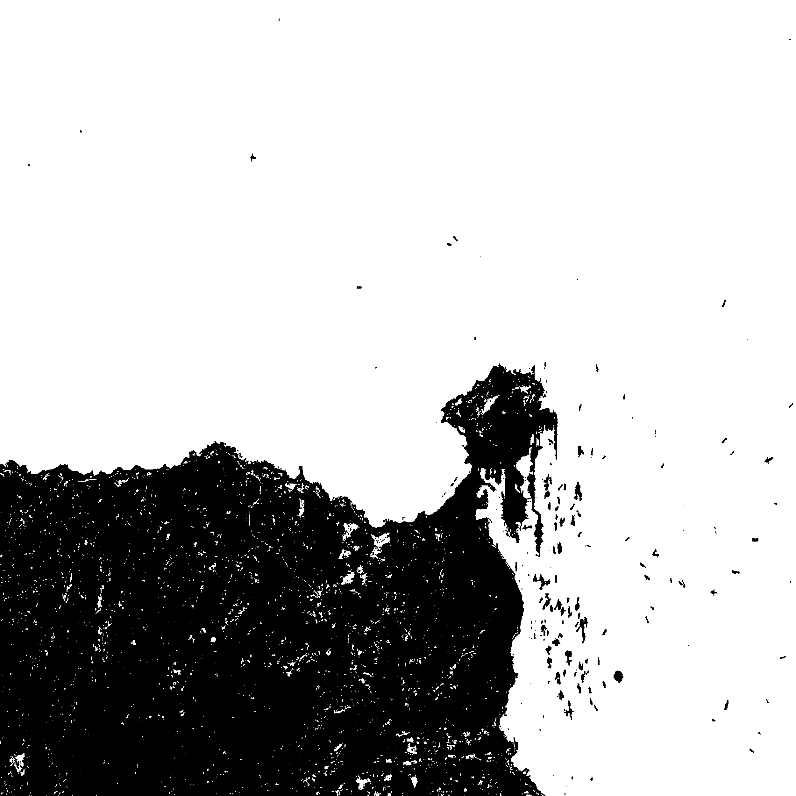 | 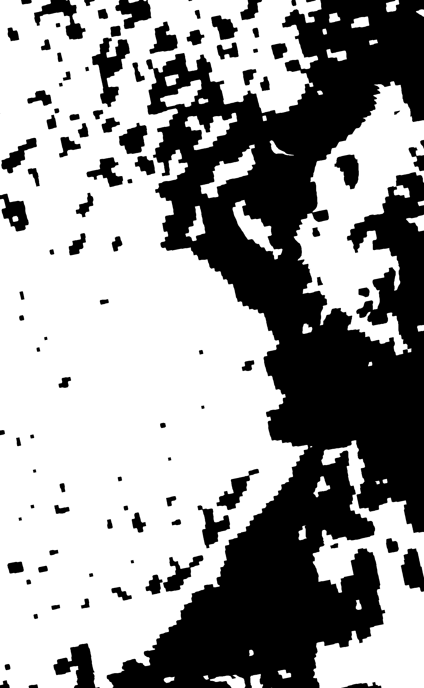 |

Para comprender la evolución completa del proceso (desde la imagen segmentada hasta la máscara binaria final), el
algoritmo generó la siguiente comparativa global:

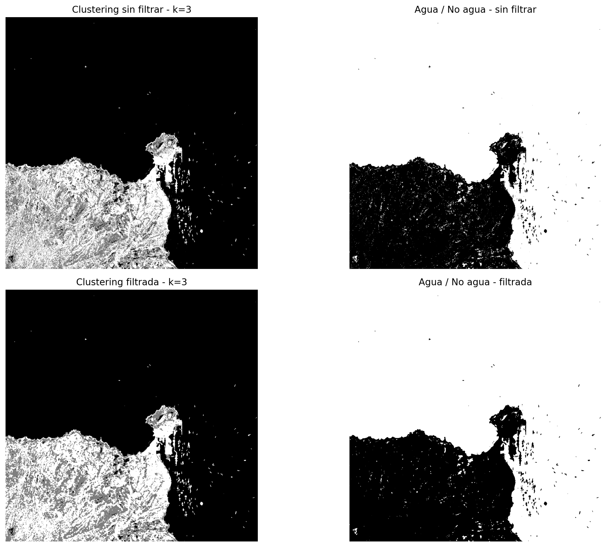

### Análisis Visual de las Máscaras

Al observar las máscaras binarias extraídas, la diferencia entre el uso de la imagen cruda y la preprocesada es
contundente:

1. **Máscara sin filtrar (Cruda):**
    * **Falsos Positivos en Tierra:** Se observan miles de puntos blancos dispersos sobre la masa continental negra.
      Estos corresponden a valles profundos de ruido *speckle* destructivo que el algoritmo confundió con agua debido a
      su baja intensidad aleatoria.
    * **Falsos Negativos en Agua:** El cuerpo de agua (blanco) presenta "agujeros" negros. Son picos de ruido
      constructivo que elevaron artificialmente la intensidad del píxel, haciendo que K-Means los clasificara
      erróneamente como tierra.
2. **Máscara filtrada (Lee):**
    * El cuerpo de agua se consolida como un bloque denso y continuo.
    * La masa continental terrestre se muestra sólida y libre de falsos positivos acuáticos.
    * La línea costera y las estructuras portuarias/geográficas que se adentran en el mar quedan perfectamente
      perfiladas, demostrando que el filtro suavizó las áreas homogéneas pero respetó las fronteras morfológicas.

### Resultados Cuantitativos (Porcentaje de Agua)
Al ejecutar la función de medición sobre la imagen completa (un total de **6.247.500 píxeles**), se obtuvieron los siguientes resultados:

* **Área de agua (Imagen sin filtrar):** **73.60%** (4.598.241 píxeles). *(Dato distorsionado inflado por falsos positivos de ruido en tierra firme).*
* **Área de agua (Imagen filtrada con Lee):** **72.98%** (4.559.601 píxeles). *(Dato real y consolidado de la superficie hídrica).*

Esto demuestra numéricamente cómo el ruido *speckle* infla erróneamente el cálculo de superficies en teledetección si no se mitiga adecuadamente. En este caso específico, el ruido provocó que **38.640 píxeles** de tierra firme fueran clasificados incorrectamente como agua en la imagen cruda.

### Conclusiones de la Extracción

* **Impacto en las métricas cuantitativas:** El cálculo del porcentaje del área cubierta por agua arrojó valores muy
  distintos al usar la imagen sin filtrar frente a la filtrada. Al no aplicar un filtro, los falsos positivos y
  negativos alteran severamente la métrica, generando un cálculo de área totalmente irreal.
* **Aplicabilidad:** La máscara generada a partir de la imagen filtrada con Lee demuestra que un *pipeline* clásico de
  visión por computador (Filtrado Espacial + K-Means + Binarización) es altamente robusto para perfilar riberas y
  costas. Esta metodología es directamente aplicable a sistemas de alerta temprana, monitoreo de inundaciones o
  delimitación automática de cuencas hidrográficas utilizando teledetección SAR.

---

## 5. Reto 4: Creación del Dataset

### Fundamento Teórico y Procedimiento Implementado (basado en `exercise_four.ipynb`)

El desarrollo de modelos avanzados de Inteligencia Artificial (como Redes Neuronales Convolucionales o GANs) para la
restauración de imágenes requiere grandes volúmenes de datos emparejados. Para generar un dataset pareado
que sirva para entrenar redes de reducción de ruido, se ejecutó un pipeline riguroso:

1. **Registro Espacial (Alineación Sub-píxel):** Aunque las imágenes provienen del mismo satélite, la órbita no es
   perfectamente idéntica en cada pasada. Usando la imagen del 2016-08-01 como plantilla (referencia
   ruidosa), las demás imágenes rescaladas fueron alineadas utilizando Maximización del Coeficiente de Correlación (ECC
   de OpenCV con MOTION_AFFINE). Esto compensa leves desplazamientos orbitales entre las
   tomas, asegurando que un píxel en la coordenada $(x, y)$ represente exactamente la misma porción de tierra
   en todas las fechas.
2. **Generación del Ground Truth (Promedio Multitemporal):** A diferencia de la fotografía óptica, en el radar rara vez
   existe una imagen "limpia" absoluta. Las imágenes exitosamente alineadas se apilaron y promediaron (
   `np.mean(stack, axis=0)`). Debido a que el speckle es aleatorio e independiente en el tiempo,
   promediar las imágenes cancela el ruido, obteniendo un Ground Truth sintético de alta calidad temporal.
   Matemáticamente, la varianza del ruido se reduce en un factor de $N$ (donde $N$ es el número de imágenes
   promediadas), preservando la resolución espacial. 3. **Generación de Parches (Patching):** Las redes neuronales
   requieren entradas de tamaño fijo y manejable. Ambas imágenes base (Noisy Reference y AverageGT) se
   recortaron en cuadrículas (crops) de 512x512 píxeles con un step de 512, poblado los directorios finales.

### Análisis Visual de las Imágenes Base del Dataset

| Imagen Base con Ruido (`NoisyBase.png`) | Ground Truth Promediado (`AverageGT.png`) |
|:---------------------------------------:|:-----------------------------------------:|
|    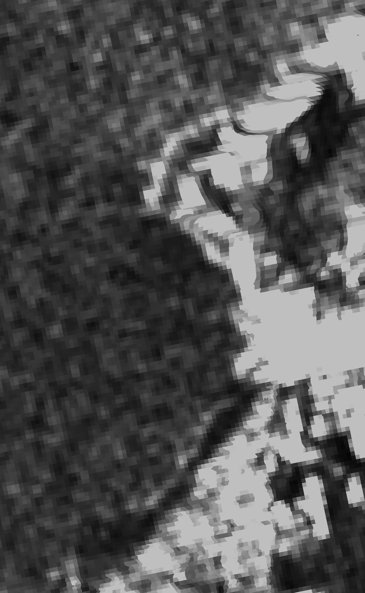    |          |

**Análisis Comparativo:** Al observar la imagen `AverageGT`, se evidencia el éxito rotundo del método multitemporal.
Mientras que el Filtro de Lee (aplicado en el Reto 1) genera un ligero difuminado tipo "acuarela" en los bordes para
reducir el ruido, el promedio multitemporal mantiene la textura real de las infraestructuras urbanas y la nitidez
milimétrica de la costa, al tiempo que el océano se vuelve una superficie completamente libre de grano. Esta imagen
promediada representa el objetivo ideal ("Ground Truth") que una IA debería aprender a generar a partir de una imagen
ruidosa.

### Parches Generados (512x512)

A continuación se muestran algunos de los pares coincidentes extraídos de las imágenes generadoras, listos para ser
introducidos en tensores de Machine Learning.

| Coordenada Y_X | Ground Truth (Limpias) - Directorio `/gtruth/` | Noisy (Ruidosas) - Directorio `/noisy/` |
|:--------------:|:----------------------------------------------:|:---------------------------------------:|
|    **0_0** |          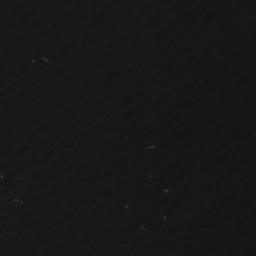           |        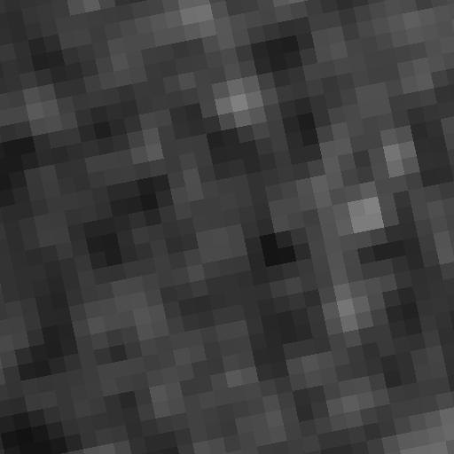        |
|   **0_512** |        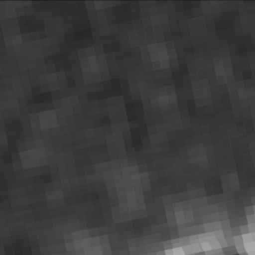         |      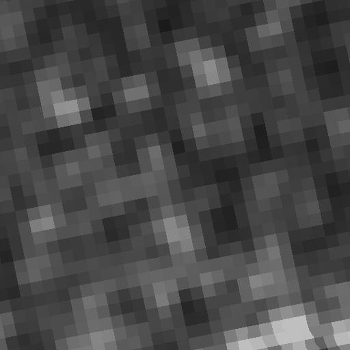      |
|   **0_1024** |       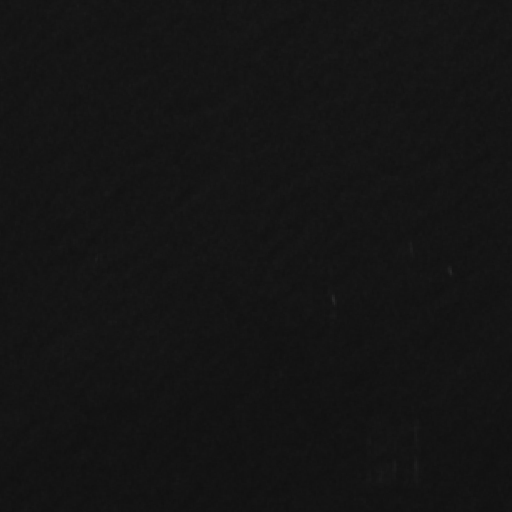        |     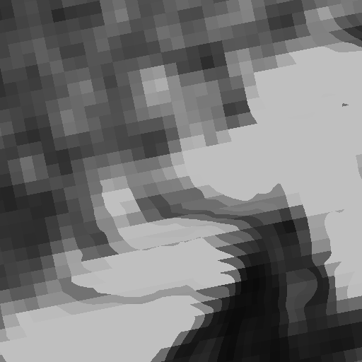     |
|   **0_1536** |       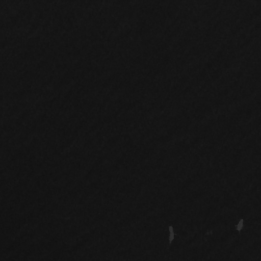        |     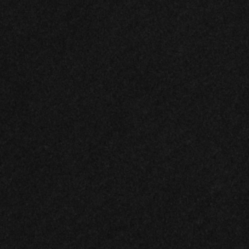     |
|   **512_0** |        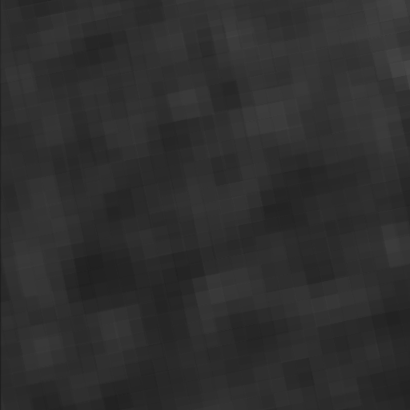         |      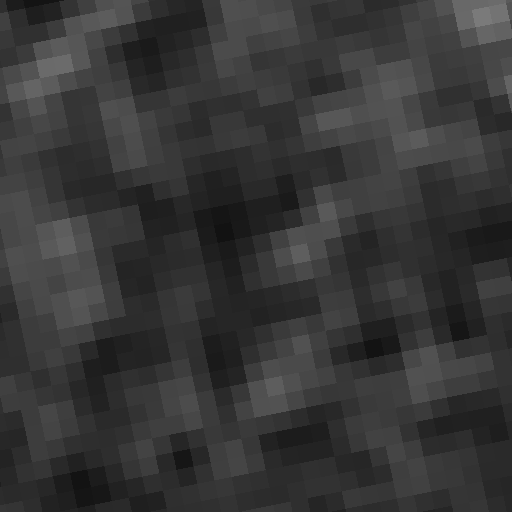      |
|  **512_512** |      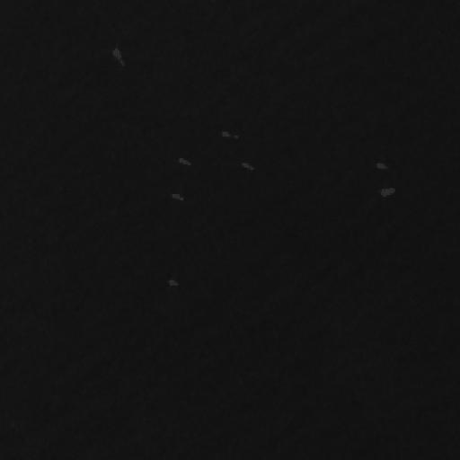       |    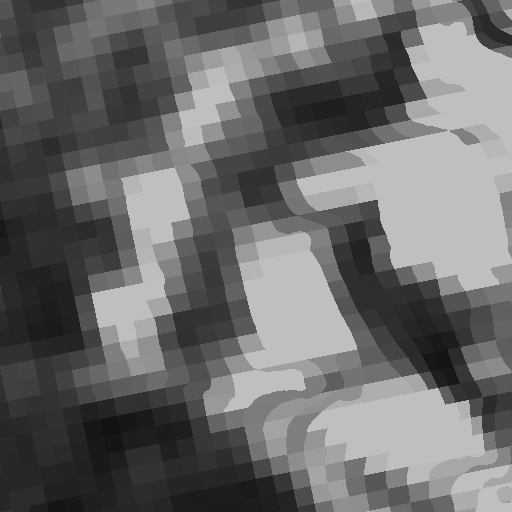    |
|  **512_1024** |     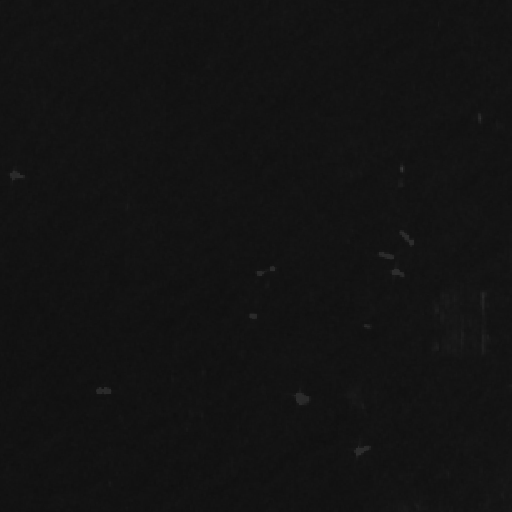      |   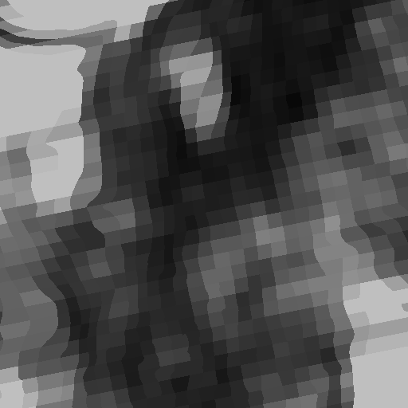   |
|  **512_1536** |     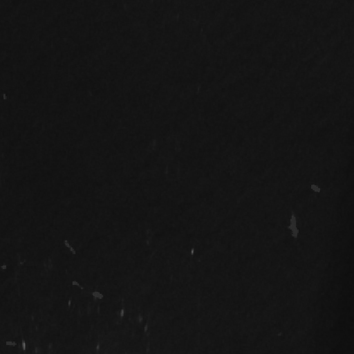      |   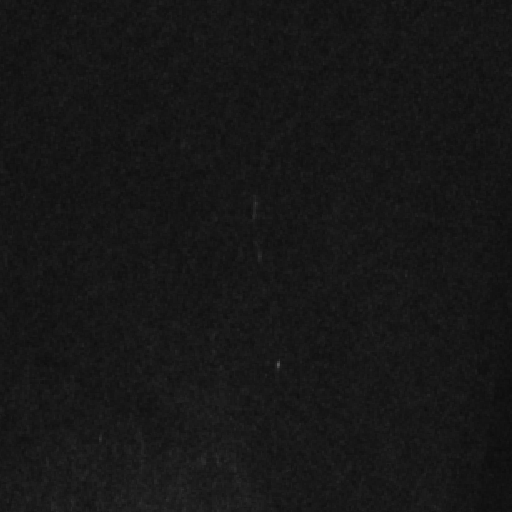   |
|   **1024_0** |       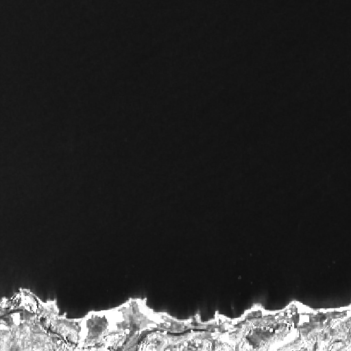        |     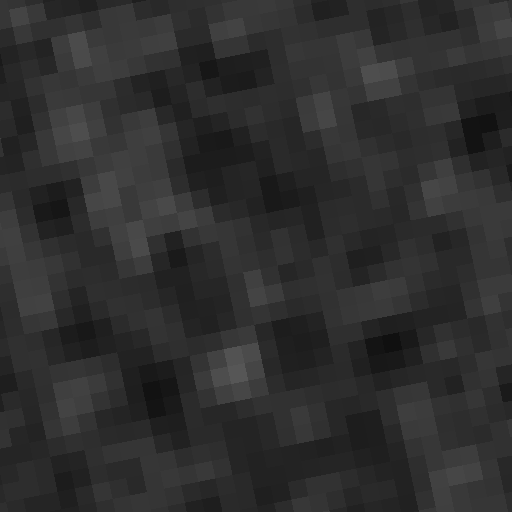     |
|  **1024_512** |     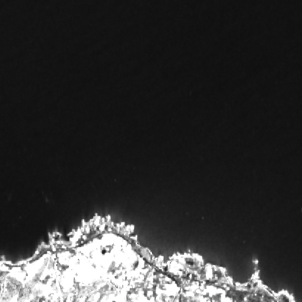      |      |
| **1024_1024** |    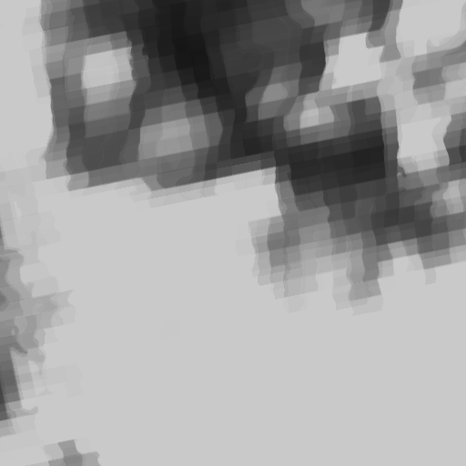     |  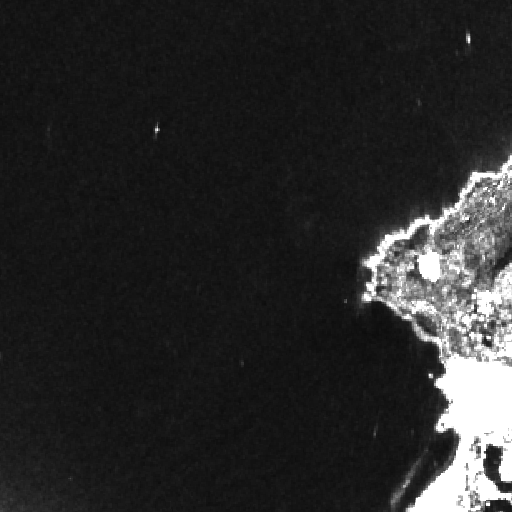  |
| **1024_1536** |    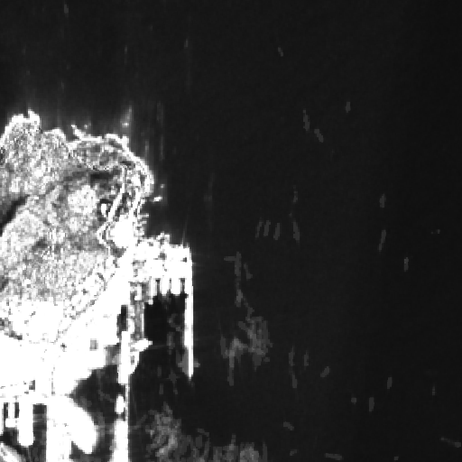     |  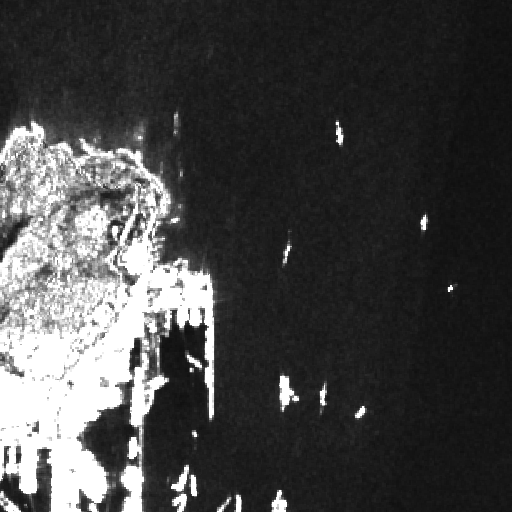  |
|   **1536_0** |       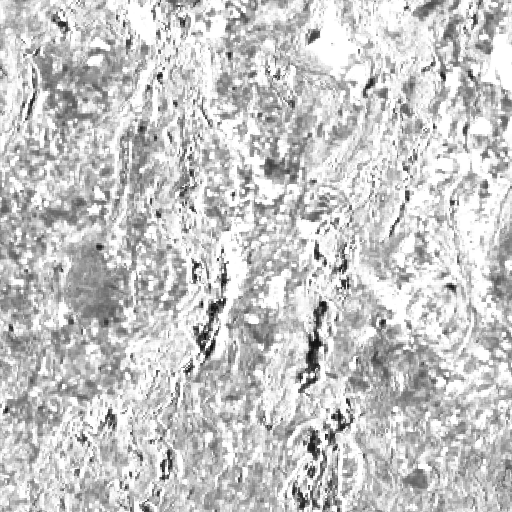        |     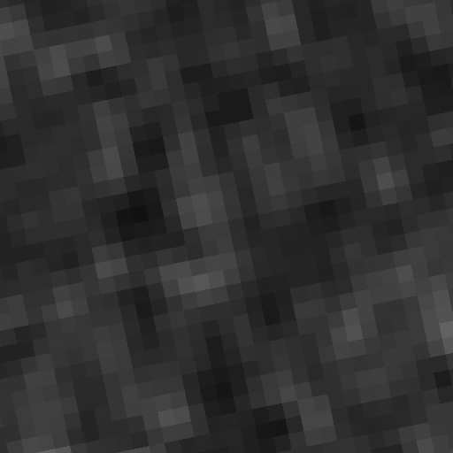     |
|  **1536_512** |     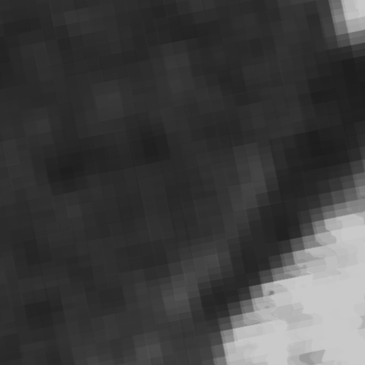      |   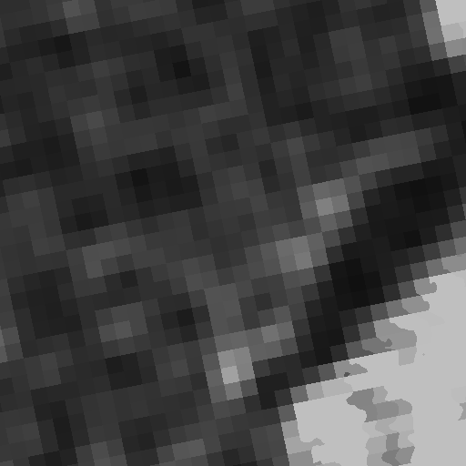   |
| **1536_1024** |    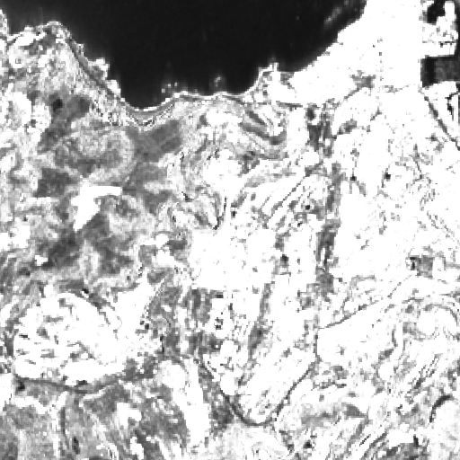     |  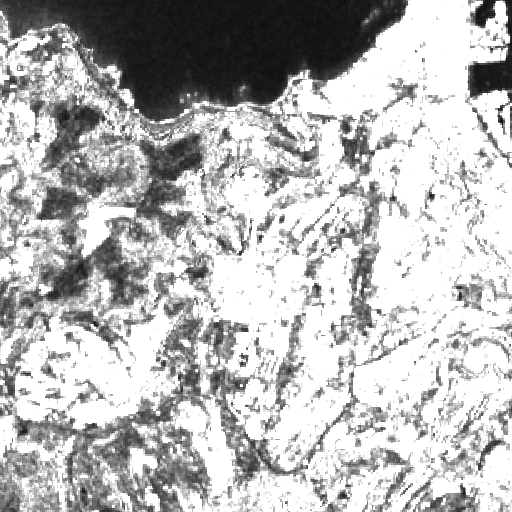  |
| **1536_1536** |    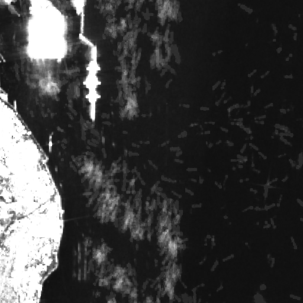     |  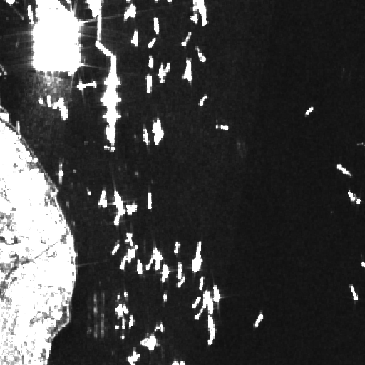  |

* **Validación de la Alineación:** Todo el proceso de corregistro sub-píxel quedó documentado en los archivos `registro_resumen_ecc.csv`. En ellos se evidencia la matriz de transformación y el coeficiente de correlación alcanzado para cada imagen respecto a la base, garantizando la fidelidad geométrica del "Ground Truth" promediado.

### Conclusiones de la Ingeniería de Datos

* El proceso automatizado ha logrado ensamblar un dataset limpio y emparejado a nivel de píxel (`dataset_resumen.csv`).
  El registro ECC fue vital, ya que si las capturas temporales presentaban mínimos desajustes geométricos, el promedio
  final habría resultado en una imagen borrosa (con "efecto fantasma"). Al examinar parches críticos (como el
  `1024_512.png` que contiene la transición entre tierra y agua), se corrobora que no hay duplicación de bordes.
* El resultado obtenido es estructuralmente coherente, conservando los detalles espaciales del área mientras suprime
  exitosamente el ruido speckle, ideal para arquitecturas de aprendizaje supervisado en tareas de denoising de imágenes
  SAR.

## 6. Conclusiones Finales del Proyecto

El desarrollo de esta guía práctica ha permitido comprobar de manera empírica y cuantitativa los desafíos y soluciones
inherentes al procesamiento de imágenes de Radar de Apertura Sintética (SAR). A partir de la secuencia temporal
analizada sobre la Base General Alemán Ramírez, se extraen las siguientes conclusiones generales:

* **Carácter Indispensable del Preprocesamiento:** El ruido multiplicativo *speckle* es el principal obstáculo en la
  teledetección por radar. Se demostró que la aplicación de filtros espaciales adaptativos, como el Filtro de Lee, no es
  un paso opcional, sino un requisito estricto. Sin este acondicionamiento previo, la alta varianza local provoca que
  los algoritmos de segmentación generen mapas ruidosos llenos de clasificaciones erróneas (falsos positivos y
  negativos)
* **Robustez de la Clasificación Basada en Física:** El algoritmo no supervisado K-Means es altamente efectivo para
  diferenciar macro-coberturas terrestres, siempre y cuando opere sobre una imagen previamente filtrada. El éxito de
  este agrupamiento radica en la física de las microondas: el algoritmo logra aislar la reflexión especular del agua (
  baja intensidad) frente al efecto de "doble rebote" de las infraestructuras urbanas (alta intensidad).
* **Viabilidad para Aplicaciones Reales:** La extracción de la máscara binaria a partir del clúster de menor intensidad
  validó que un *pipeline* clásico (Filtrado + Clustering + Binarización) es una metodología robusta para perfilar
  riberas y costas de forma automática. Esto tiene una aplicabilidad directa y fundamental en sistemas de alerta
  temprana y monitoreo de inundaciones.
* **Ingeniería de Datos como Puente hacia el Deep Learning:** La falta de imágenes SAR "limpias" absolutas se resolvió
  exitosamente combinando el registro espacial sub-píxel (ECC) con el promediado multitemporal. El dataset final de
  parches emparejados de 512x512 demuestra que es posible generar un "Ground Truth" sintético coherente y sin pérdida de
  bordes, proporcionando la estructura ideal para entrenar futuras arquitecturas de aprendizaje supervisado enfocadas en
  el *denoising* de imágenes satelitales.

## 7. Estructura del Repositorio e Instrucciones de Ejecución

Este proyecto ha sido modularizado en cuadernos de Jupyter (*Notebooks*) para facilitar la evaluación paso a paso de cada reto.

### Estructura de Archivos Principal
* `exercise_one.ipynb`: Código para el rescalizado y filtrado espacial (Filtro de Lee).
* `exercise_two.ipynb`: Implementación del algoritmo K-Means no supervisado.
* `exercise_three.ipynb`: Extracción de la máscara binaria y cálculo de área hídrica.
* `exercise_four.ipynb`: Corregistro ECC multitemporal y generación del dataset de parches.
* Directorios de Salida: Las carpetas `/filtered`, `/cluster`, `/water_mask`, `/noisy` y `/gtruth` contienen los resultados de cada etapa de procesamiento.

### ¿Cómo ejecutar este proyecto?

1. Clonar este repositorio.
2. Crear un entorno virtual de Python (recomendado 3.9+).
3. Instalar las dependencias necesarias mediante el archivo provisto:
   ```bash
   pip install -r requirements.txt