# Informe de Proyecto: Teledetección con Radar (Sentinel-1)

**Institución:** Politécnico Colombiano Jaime Isaza Cadavid
**Asignatura:** Visión por computador e Inteligencia Artificial
**Guía Práctica:** 3 (Parcial 1)

---

## 1. Introducción y Contexto de Estudio

La teledetección mediante Radar de Apertura Sintética (SAR) es una herramienta poderosa que permite observar la superficie terrestre independientemente de las condiciones climáticas o la iluminación solar. Sin embargo, el procesamiento de estas imágenes presenta un desafío inherente: la presencia de un ruido multiplicativo conocido como *speckle*, el cual dificulta la interpretación visual y la segmentación automática.

Este documento presenta el desarrollo y los resultados de la **Guía Práctica 3** de la asignatura Visión por Computador e Inteligencia Artificial. El objetivo del proyecto es implementar un *pipeline* completo de visión por computador sobre una secuencia temporal de 10 imágenes satelitales SAR (misión Sentinel-1, polarización VV).

### Zona de Estudio: Base General Alemán Ramírez (Base GAR)
Para cumplir con el criterio principal de la práctica, se seleccionó como área de interés la zona costera de la **Base General Alemán Ramírez (Base GAR)** y sus cuerpos hídricos adyacentes. Esta ubicación geográfica es ideal para el análisis espacial con radar, ya que ofrece un alto contraste dieléctrico y morfológico entre el océano, la accidentada línea costera y las densas estructuras urbanas/militares contiguas.

A continuación, se presenta una imagen óptica de referencia de la región seleccionada para facilitar la interpretación de las coberturas terrestres durante el análisis de las imágenes de radar:

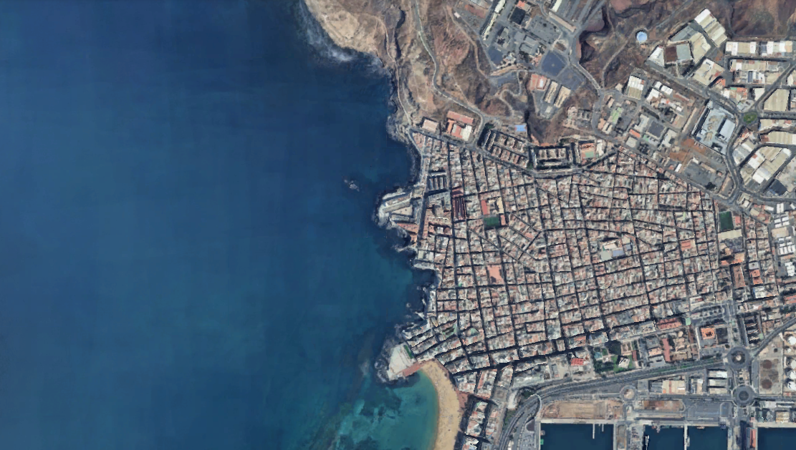
*Figura 1: Vista óptica (Google Maps/Earth) de la región de interés, destacando el cuerpo de agua y el entorno urbano de la Base GAR.*

### Objetivos y Retos del Proyecto
Para abordar el procesamiento de esta escena, el informe documenta la solución de los siguientes cuatro retos secuenciales:

1. **Reto de Imágenes y Filtrado:** Rescalizado de las intensidades del radar para su correcta visualización y aplicación del Filtro local de Lee para la mitigación del ruido *speckle*.
2. **Reto de Clasificación No Supervisada:** Segmentación de las coberturas de la escena (agua, vegetación, edificaciones) utilizando el algoritmo de agrupamiento K-Means, evaluando el impacto directo del filtrado previo en la calidad de los clústeres.
3. **Reto de Clasificación Agua/No Agua:** Binarización de los resultados del *clustering* para aislar exclusivamente los cuerpos hídricos y cuantificar su porcentaje de área en la imagen.
4. **Reto de Creación de Dataset:** Construcción de un conjunto de datos estructurado en parches de $512 \times 512$ píxeles. Esto se logra mediante el registro espacial (alineación) de las 10 imágenes temporales y su promediado para generar un "Ground Truth" libre de ruido, creando así pares de imágenes (Noisy vs. Ground Truth) listos para entrenar futuros modelos de Deep Learning.

---

## 2. Reto 1: Imágenes y Filtrado

### Procedimiento Implementado (basado en `exercise_one.ipynb`)
1. **Rescalizado:** Las imágenes SAR originales (`/raw/`) poseen valores de intensidad con un rango dinámico muy amplio. Se implementó una función que limita los valores máximos a 3 veces la media de la imagen original (`escala_display = np.mean(img2) * 3.0`), asignando los valores superiores a este umbral y normalizando el resultado a 8 bits (0-255) tipo `uint8`.
2. **Filtrado:** Se aplicó un **Filtro de Lee** con un tamaño de ventana de $7 \times 7$. Este filtro calcula la media y varianza local para determinar si un píxel corresponde a un área homogénea (donde aplica un suavizado fuerte) o a un borde (donde preserva el valor original). 

### Evidencias Visuales
A continuación, se define el área de estudio y las Regiones de Interés (ROIs) marcadas para analizar el impacto del filtro:

**Comparativa General Base:**
| Imagen Reescalada (Sin Filtrar) | Imagen Filtrada (Lee) |
| :---: | :---: |
|  |  |

### Secuencia Temporal (Imágenes Reescaladas y Filtradas)
Se procesaron 10 imágenes correspondientes a distintas fechas. A continuación se muestran todas las imágenes resultantes en sus respectivas carpetas:

| Fecha / Archivo | Original Rescalada (`/scaled/`) | Filtrada con Lee (`/filtered/`) |
| :--- | :---: | :---: |
| **2016-06-14** |  | 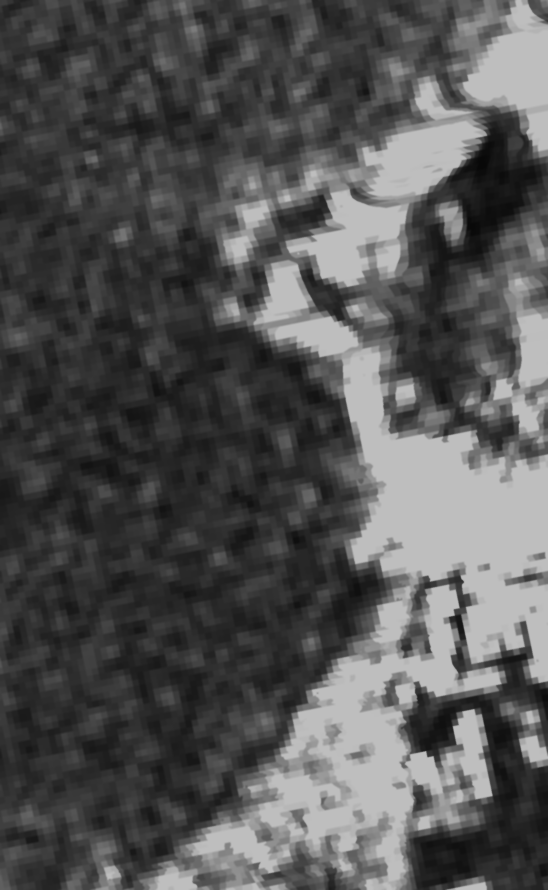 |
| **2016-07-08** | 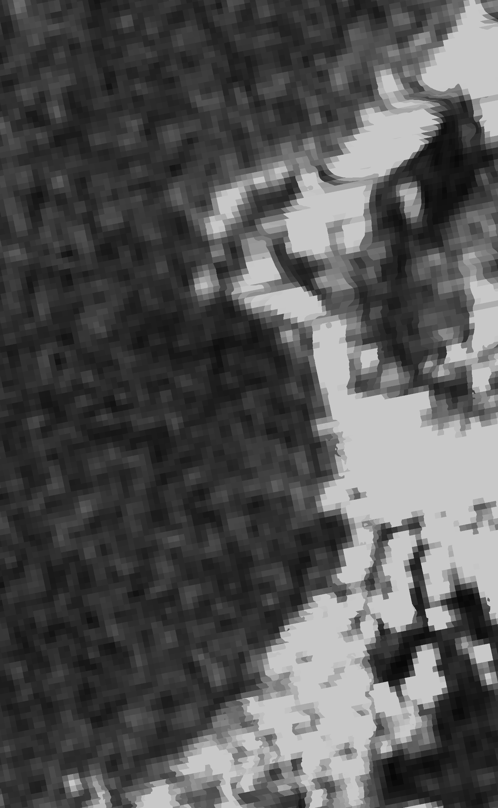 |  |
| **2016-07-20** |  | 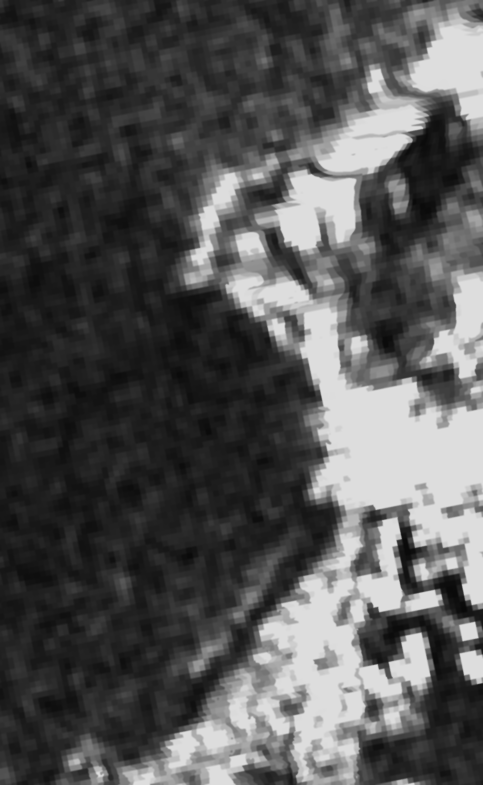 |
| **2016-07-26** |  | 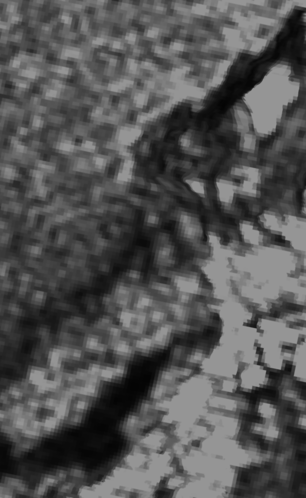 |
| **2016-08-01** | 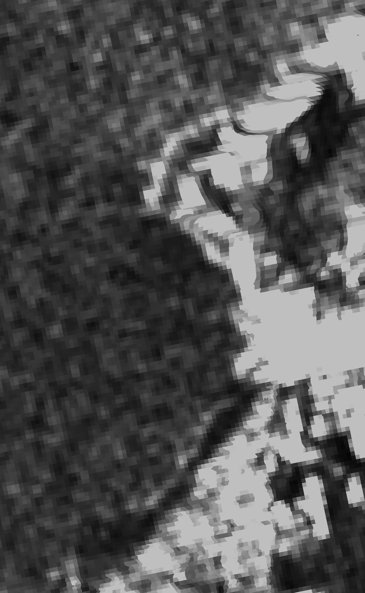 |  |
| **2016-08-13** | 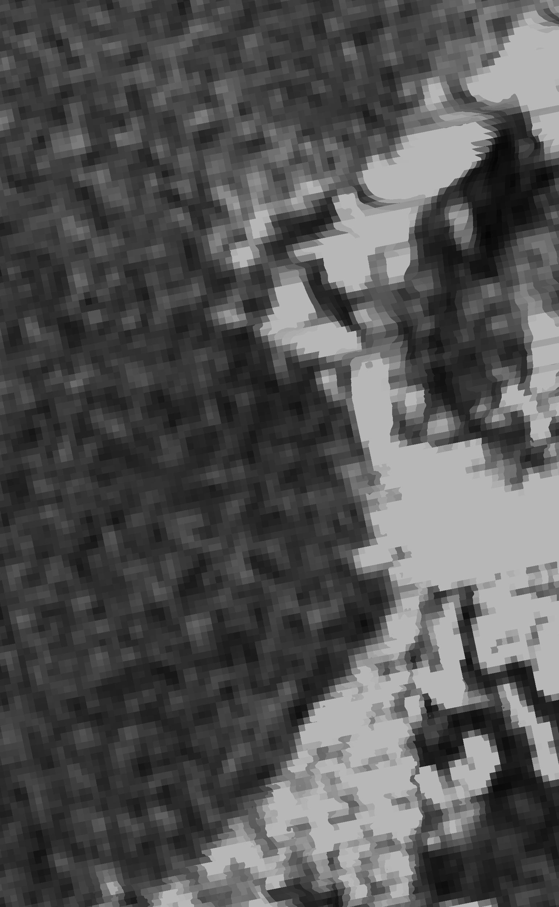 | 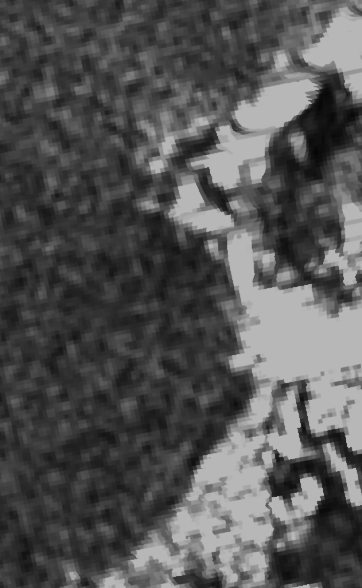 |
| **2016-08-19** | 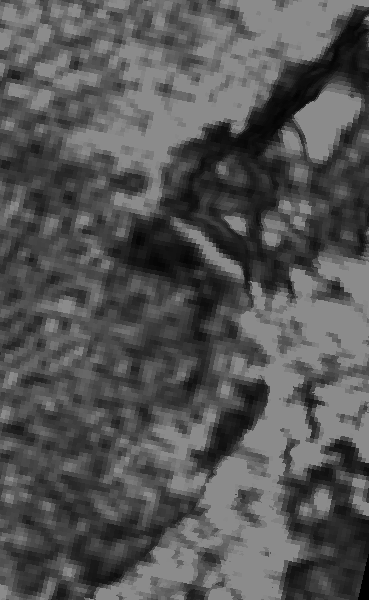 |  |
| **2016-08-25** |  | 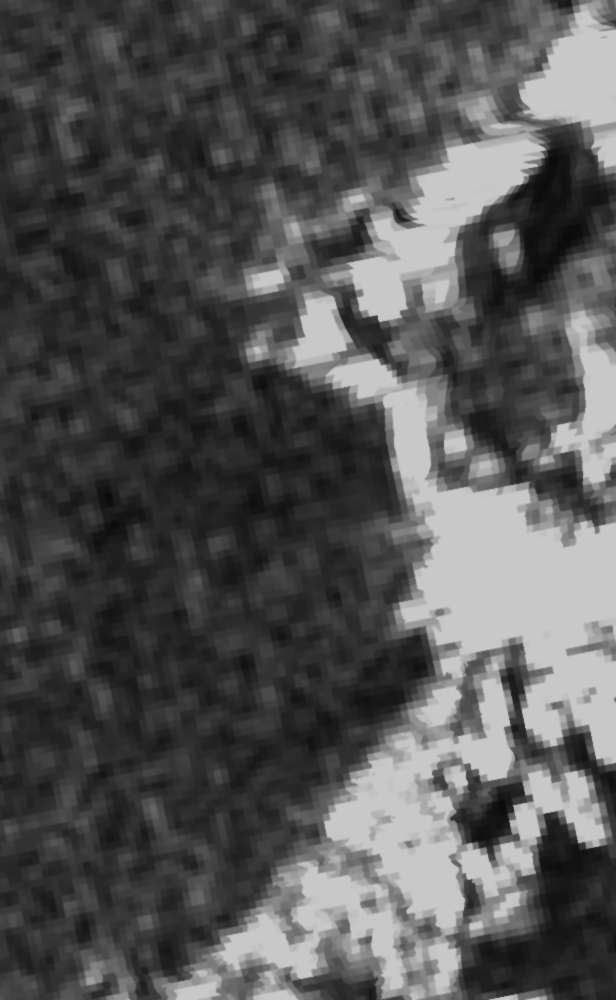 |
| **2016-09-06** |  | 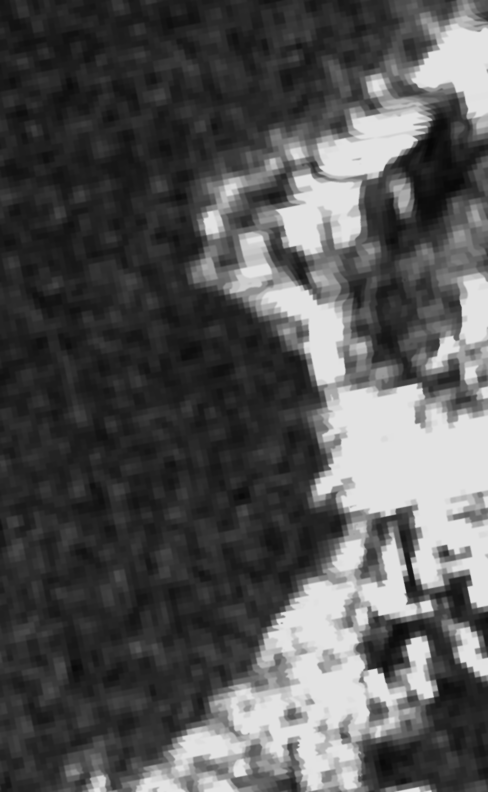 |
| **2016-09-12** | 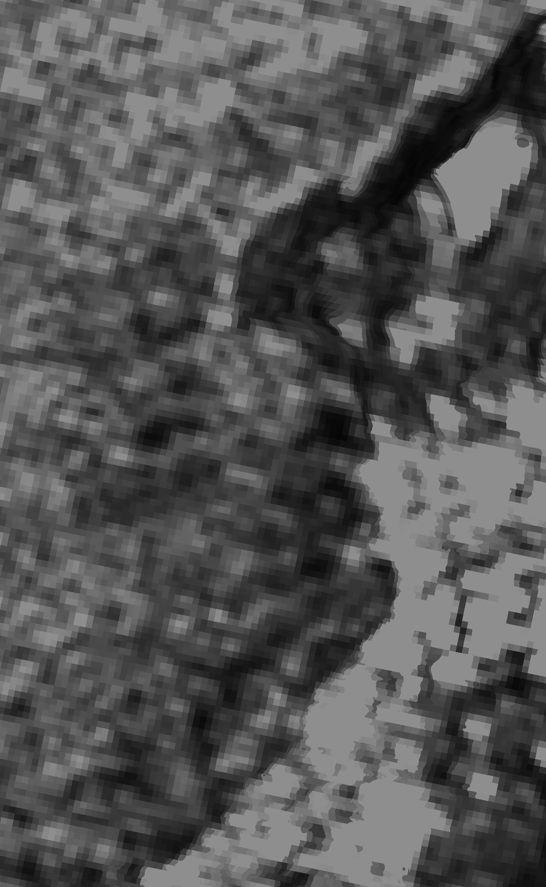 |  |

### Conclusiones del Filtrado
El código comprobó matemáticamente la efectividad del filtro al evaluar la desviación estándar de las regiones de interés antes y después. El Filtro de Lee reduce drásticamente la varianza local (suaviza el ruido de sal y pimienta) sin destruir los contornos geográficos relevantes.

---

## 3. Reto 2: Clasificación No Supervisada

### Procedimiento Implementado (basado en `exercise_two.ipynb`)
Se aplicó el algoritmo **K-Means** sobre los arreglos de píxeles unidimensionales, configurando el algoritmo para $k=3$ y $k=4$ clústeres. 
Una parte vital del código consistió en **ordenar los centroides** de menor a mayor intensidad (`np.argsort(centers)`) para reasignarles un valor equidistante en escala de grises (0 a 255). Esto garantiza que la clase 0 siempre corresponda a la reflexión más baja (el agua) independientemente de la iteración aleatoria de K-Means.

### Resultados de Agrupamiento
| K-Means | Imagen Sin Filtrar | Imagen Filtrada (Lee) |
| :---: | :---: | :---: |
| **k = 3** |  |  |
| **k = 4** |  |  |

### Conclusiones de la Clasificación
* **El efecto del ruido en la clasificación:** Aplicar algoritmos de segmentación sobre imágenes SAR sin filtrar resulta en máscaras ruidosas sin utilidad práctica. Los píxeles afectados por speckle constructivo/destructivo se clasifican como falsos positivos en zonas terrestres y acuáticas.
* **Identificación de clases:** Al observar los resultados filtrados, se identifica que la clase más oscura corresponde al agua (reflexión especular que aleja el pulso del sensor). Las clases grises representan la vegetación y el suelo (dispersión volumétrica). La clase blanca representa zonas de edificaciones humanas, donde ocurre el fenómeno de "doble rebote" devolviendo un retorno intenso al sensor.

---

## 4. Reto 3: Clasificación de Agua / No Agua

### Procedimiento Implementado (basado en `exercise_three.ipynb`)
Utilizando los resultados de K-Means con $k=3$, se binarizó la imagen usando la instrucción `np.where(cluster == 0, 255, 0)`. Dado que previamente forzamos a que el centroide de menor intensidad fuera el valor 0, esta máscara extrae el agua pintándola de blanco (255) y oscureciendo (0) el resto.

### Evidencias Visuales
| Máscara a partir de imagen sin filtrar | Máscara a partir de imagen filtrada |
| :---: | :---: |
|  |  |

*Vista completa de la comparativa generada en el código:*

### Conclusiones
La medición del porcentaje de área cubierta por agua (`porcentaje_agua(mask)`) se ve severamente alterada por el ruido si no se filtra la imagen. La máscara generada a partir de la imagen filtrada con Lee permite delinear perfectamente las riberas y las costas, consolidándose como una herramienta viable para monitoreos automáticos de inundaciones o cuerpos hídricos.

---

## 5. Reto 4: Creación del Dataset

### Procedimiento Implementado (basado en `exercise_four.ipynb`)
Para generar un dataset pareado que sirva para entrenar redes de reducción de ruido, se ejecutó un pipeline riguroso:
1. **Registro Espacial:** Usando la imagen del `2016-08-01` como plantilla (referencia ruidosa), las demás imágenes rescaladas fueron alineadas utilizando Maximización del Coeficiente de Correlación (**ECC** de OpenCV con `MOTION_AFFINE`). Esto compensa leves desplazamientos orbitales entre las tomas.
2. **Promedio Multitemporal (Ground Truth):** Las imágenes exitosamente alineadas se apilaron y promediaron (`np.mean(stack, axis=0)`). Debido a que el speckle es aleatorio e independiente en el tiempo, promediar las imágenes cancela el ruido, obteniendo un *Ground Truth* sintético de alta calidad temporal.
3. **Generación de Parches:** Ambas imágenes base (Noisy Reference y AverageGT) se recortaron en cuadrículas (*crops*) de $512 \times 512$ píxeles con un *step* de 512, poblado los directorios finales.

### Imágenes Base del Dataset
| Imagen Base con Ruido (`NoisyBase.png`) | Ground Truth Promediado (`AverageGT.png`) |
| :---: | :---: |
|  |  |

### Parches Generados ($512 \times 512$)
A continuación se muestran los 12 pares coincidentes extraídos de las imágenes generadoras. 

| Coordenada Y_X | Ground Truth (Limpias) - Directorio `/gtruth/` | Noisy (Ruidosas) - Directorio `/noisy/` |
| :---: | :---: | :---: |
| **0_0** |  |  |
| **0_512** |  |  |
| **0_1024** |  |  |
| **512_0** |  |  |
| **512_512** |  |  |
| **512_1024** |  |  |
| **1024_0** |  |  |
| **1024_512** |  |  |
| **1024_1024** |  |  |
| **1536_0** |  |  |
| **1536_512** |  |  |
| **1536_1024** |  |  |

### Conclusiones del Dataset
El proceso automatizado ha logrado ensamblar un dataset limpio y emparejado a nivel de píxel (`dataset_resumen.csv`). El registro ECC fue vital, ya que si las capturas temporales presentaban mínimos desajustes geométricos, el promedio final habría resultado en una imagen borrosa (con "efecto fantasma"). El resultado obtenido es estructuralmente coherente, conservando los detalles espaciales del área mientras suprime exitosamente el ruido speckle, ideal para arquitecturas de aprendizaje supervisado en tareas de denoising de imágenes SAR.