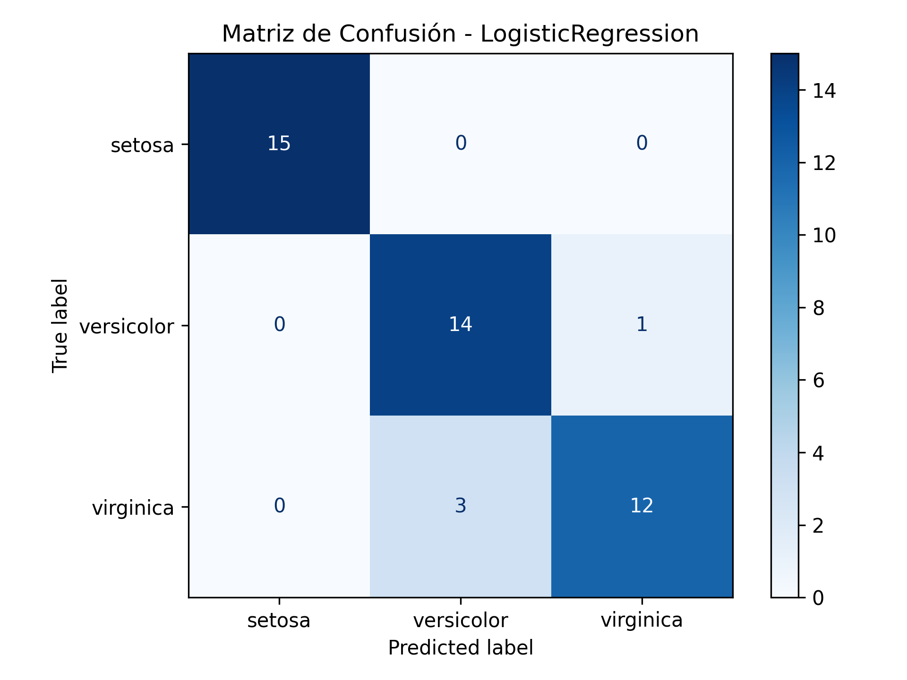
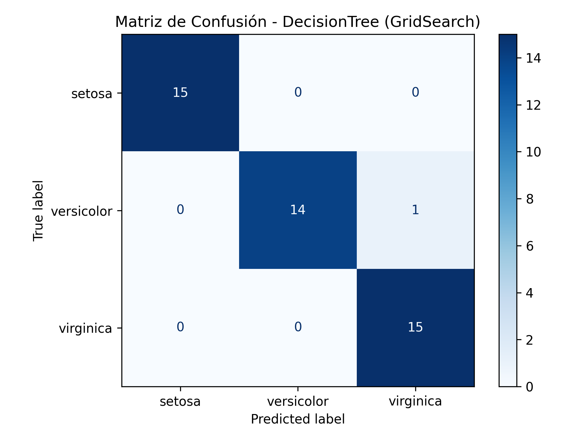
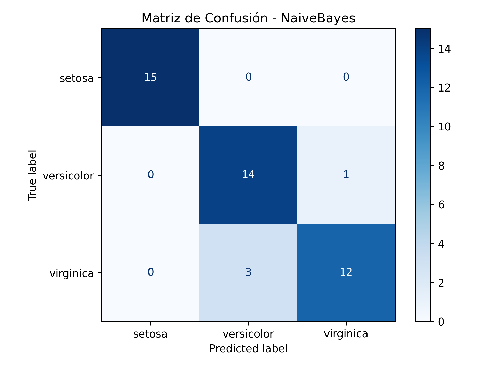
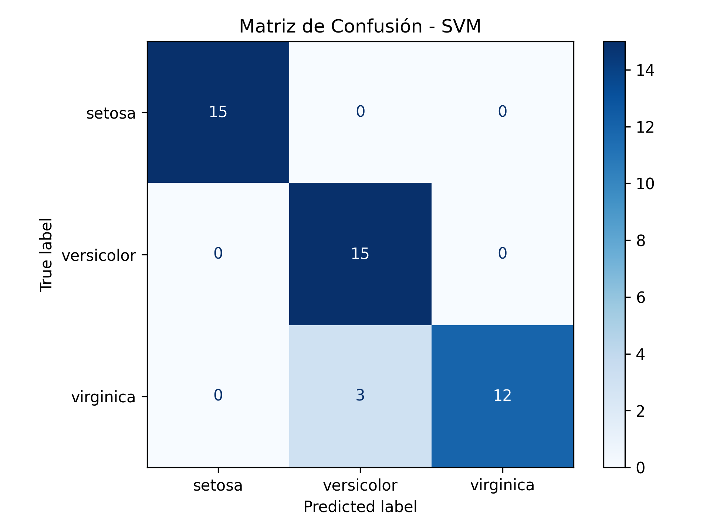
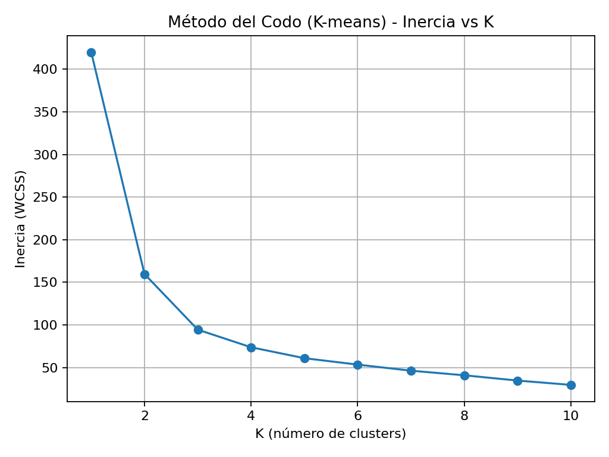
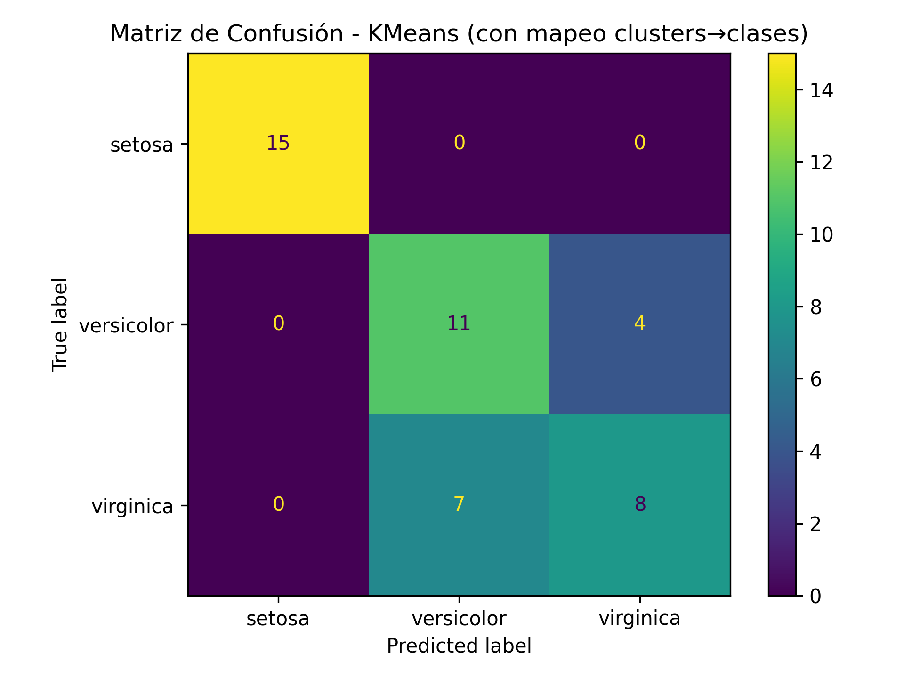
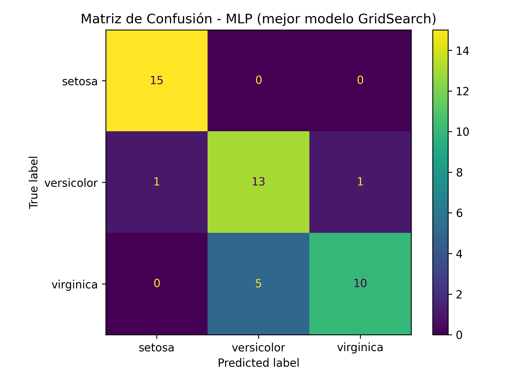
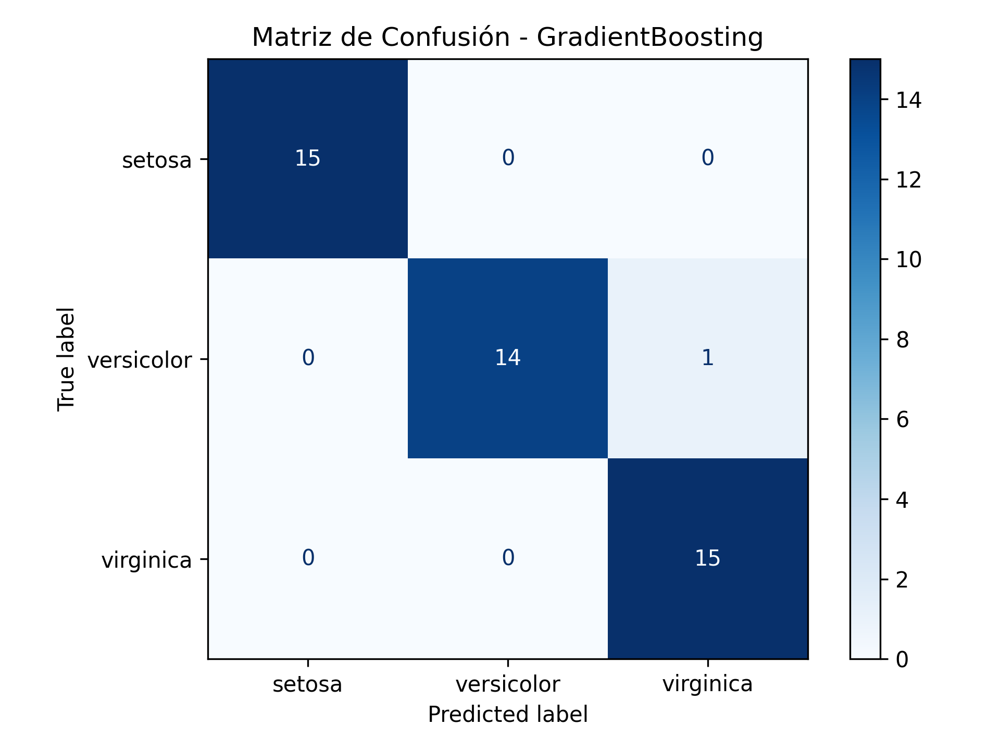
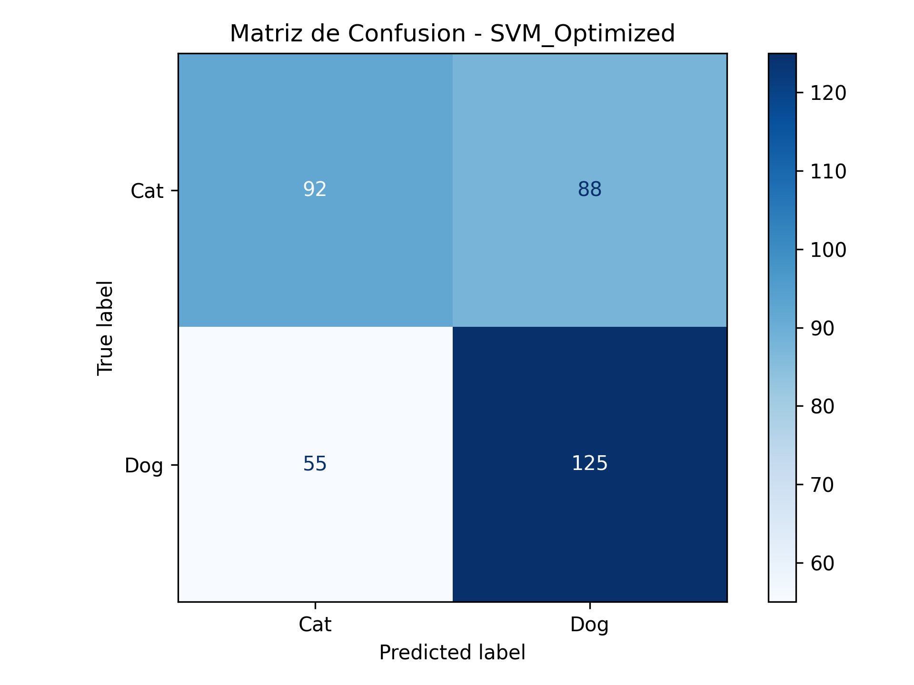
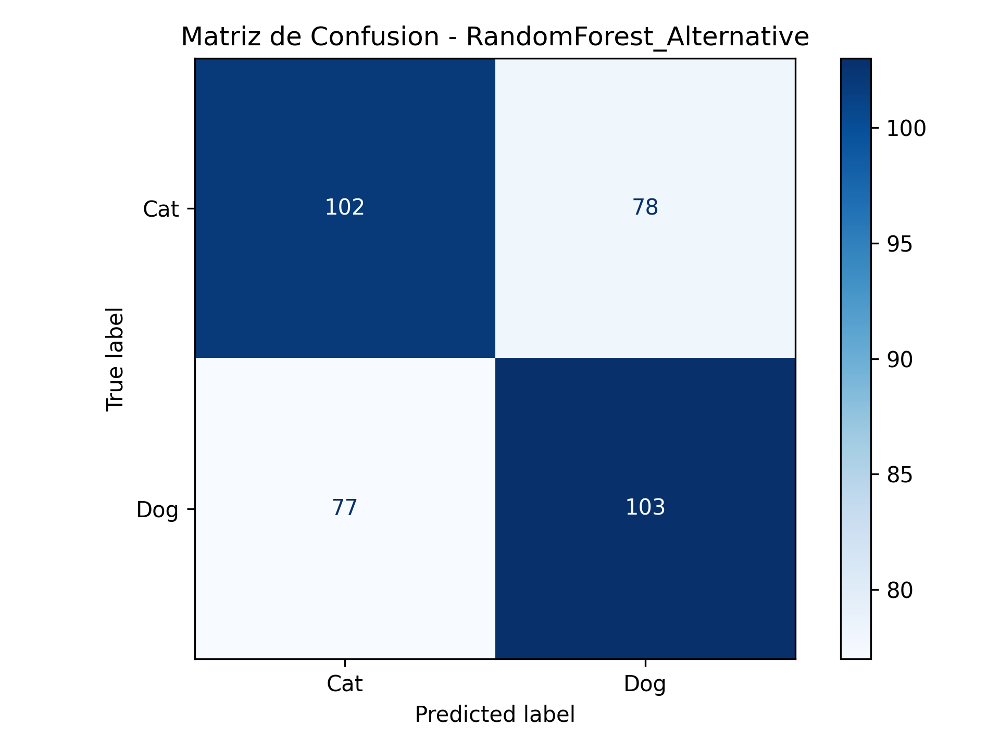

# Informe de Resultados: Aprendizaje Automático y Visión por Computador

Este documento resume los resultados obtenidos en los ejercicios de la guía. El informe se apoya en:

- Los archivos `.json` de [`app/results`](app/results)
- Las matrices de confusión generadas en cada ejercicio
- La evidencia gráfica incluida en el proyecto

## Resumen

| Ejercicio | Problema | Mejor enfoque | Métrica principal |
| --- | --- | --- | --- |
| 1 | Iris parte 1 | Decision Tree | Accuracy = **0.9778** |
| 2 | Iris parte 2 | SVM lineal | Accuracy = **0.9333** |
| 3 | Iris parte 3 | MLP | Accuracy = **0.8444** |
| 4 | Iris parte 4 | Gradient Boosting | Accuracy = **0.9778** |
| 5 | Escenas 3Scenes | RGB + Textura con SVM-RBF | F1-macro = **0.9163** |
| 6 | Cats vs Dogs | SVM baseline | Accuracy = **0.6111** |

La tendencia general es clara: en Iris, varios modelos clásicos alcanzan desempeños altos; en escenas, la calidad sube cuando se combinan color y textura; y en perros vs gatos el aplanado de píxeles limita fuertemente el rendimiento.

---

## 1. Clasificación de Flores Parte 1

Dataset: `Iris` con partición 70/30.

### Resultados

| Modelo | Accuracy | Comentario |
| --- | ---: | --- |
| Logistic Regression | 0.9111 | Buen baseline, confunde parte de `versicolor` y `virginica` |
| Decision Tree | **0.9778** | Mejor resultado global |
| Random Forest | 0.9111 | No mejora frente al baseline en esta corrida |

El árbol de decisión fue el más consistente. Según el reporte en `ejercicio1.json`, logró `precision = 1.00` y `recall = 1.00` en `setosa`, y solo cometió un error entre `versicolor` y `virginica`.

### Interpretación

- `setosa` queda perfectamente separada.
- La frontera difícil sigue estando entre `versicolor` y `virginica`.
- En este problema, un árbol bien ajustado fue suficiente; el ensamble no aportó mejora real.

### Evidencia

#### Logistic Regression

#### Decision Tree

#### Random Forest

### Conclusión

Para Iris parte 1, el mejor modelo fue **Decision Tree**, con una clasificación casi perfecta y una matriz de confusión muy limpia.

---

## 2. Clasificación de Flores Parte 2

Se compararon dos enfoques: **Naive Bayes** y **SVM**.

### Resultados

| Modelo | Accuracy | Configuración destacada |
| --- | ---: | --- |
| Naive Bayes | 0.9111 | `var_smoothing = 1e-09` |
| SVM | **0.9333** | `C = 100`, `gamma = scale`, `kernel = linear` |

El `json` muestra que SVM mejora ligeramente el accuracy y también el F1 macro (`0.9327`), manteniendo separación perfecta para `setosa`.

### Interpretación

- Naive Bayes sigue siendo competitivo, pero asume independencia condicional entre variables.
- SVM lineal aprovecha mejor la separación geométrica del dataset.
- El error vuelve a concentrarse en la clase `virginica`.

### Evidencia

#### Naive Bayes

#### SVM

### Conclusión

El mejor resultado fue para **SVM**, confirmando que el dataset Iris puede resolverse con fronteras lineales bien definidas cuando el margen se ajusta adecuadamente.

---

## 3. Clasificación de Flores Parte 3

Se enfrentó un método **no supervisado** contra uno **supervisado**.

### Resultados

| Modelo | Tipo | Accuracy |
| --- | --- | ---: |
| K-Means | No supervisado | 0.7556 |
| MLP | Supervisado | **0.8444** |

Además, el script del ejercicio ajusta:

- `K = 3` para K-Means, apoyado por el método del codo
- Un `MLPClassifier` con búsqueda de hiperparámetros sobre capas ocultas, activación y regularización

### Interpretación

- K-Means necesita mapear clusters a clases y por eso sufre más en la frontera entre `versicolor` y `virginica`.
- MLP mejora porque aprende directamente desde etiquetas.
- La diferencia entre ambos valida el valor de la supervisión incluso en un dataset relativamente pequeño.

### Evidencia

#### Método del codo

#### K-Means

#### MLP

### Conclusión

El mejor modelo fue **MLP**, con mejora clara sobre K-Means. El ejercicio muestra bien la diferencia entre agrupar por similitud geométrica y clasificar con aprendizaje supervisado.

---

## 4. Clasificación de Flores Parte 4

En esta sección se incorporaron **KNN** y **Gradient Boosting**.

### Resultados

| Modelo | Accuracy | Configuración |
| --- | ---: | --- |
| KNN | 0.9333 | `n_neighbors = 7`, `weights = distance`, `metric = euclidean` |
| Gradient Boosting | **0.9778** | `learning_rate = 0.01`, `max_depth = 4`, `n_estimators = 50` |

El comportamiento de `GradientBoosting` es prácticamente idéntico al mejor árbol del ejercicio 1, con F1 macro de `0.9778`.

### Interpretación

- KNN funciona bien porque las muestras similares permanecen cerca en el espacio de características.
- Gradient Boosting corrige errores de forma iterativa y logra una frontera más robusta.
- Otra vez, el único punto delicado está entre `versicolor` y `virginica`, pero el ensamble lo maneja casi perfecto.

### Evidencia

#### KNN

#### Gradient Boosting

### Conclusión

El mejor desempeño lo obtuvo **Gradient Boosting**, consolidándose como uno de los enfoques clásicos más sólidos sobre Iris.

---

## 5. Clasificación de Escenas: Costas, Bosques y Autopistas

Se evaluaron cinco espacios de características sobre el dataset `3Scenes`. En este ejercicio la métrica más representativa es **F1-macro**.

### Comparativa principal

| Espacio de características | Mejor modelo | Accuracy test | F1-macro test |
| --- | --- | ---: | ---: |
| RGB | SVM-RBF | 0.8333 | 0.8289 |
| RGB + HSV | SVM-RBF | 0.8299 | 0.8274 |
| Textura | Random Forest | 0.8819 | 0.8772 |
| RGB + Textura | **SVM-RBF** | **0.9201** | **0.9163** |
| RGB + HSV + Textura | MLP | 0.9167 | 0.9137 |

### Lectura de resultados

- El color por sí solo funciona razonablemente bien, pero no alcanza el mejor nivel.
- La textura aporta una ganancia clara: con `TEXTURE`, `forest` alcanza un F1 de `0.9949`.
- La mejor combinación global fue **RGB + Textura**, con `SVM-RBF`, lo que sugiere que color y patrón espacial son complementarios.
- Añadir HSV sobre color + textura no mejora el mejor resultado; incluso queda ligeramente por debajo.

### Conclusión

En escenas, la información de textura fue decisiva. El mejor pipeline fue **RGB + Textura con SVM-RBF**, con `F1-macro = 0.9163`, el valor más alto de todo el ejercicio.

---

## 6. Clasificación de Perros y Gatos

Se trabajó con una muestra balanceada de `1200` imágenes (`600` por clase), transformadas a escala de grises y luego a vectores de `64 x 64 = 4096` características.

### Resultados

| Modelo | Accuracy | F1-macro | Observación |
| --- | ---: | ---: | --- |
| SVM Baseline | **0.6111** | **0.6094** | Mejor resultado de los tres |
| SVM Optimized | 0.5944 | 0.5926 | `C = 1`, kernel `rbf` |
| Random Forest Alternative | 0.5944 | 0.5938 | Similar al SVM optimizado |

### Lectura por clase

#### SVM Baseline

- `Cat`: precision `0.6282`, recall `0.5444`
- `Dog`: precision `0.5980`, recall `0.6778`

#### SVM Optimized

- `Cat`: recall mejora a `0.6611`
- `Dog`: recall cae a `0.5278`

#### Random Forest Alternative

- Rendimiento más equilibrado que SVM optimizado
- Pero sin superar el baseline

### Interpretación

- La representación por píxeles aplanados destruye relaciones espaciales importantes.
- Los tres modelos quedan apenas por encima del azar, lo que confirma que el problema es más complejo que Iris o 3Scenes.
- El ajuste de hiperparámetros no compensó la debilidad de la representación.

### Evidencia

#### SVM Baseline

#### SVM Optimized

#### Random Forest Alternative

### Conclusión

El mejor modelo fue **SVM Baseline**, pero con un accuracy de solo `0.6111`. El ejercicio deja claro que, para clasificación de imágenes reales, los modelos clásicos sobre píxeles crudos se quedan cortos frente a enfoques con extracción espacial de características, como CNN.

---

## Conclusiones Globales

1. En `Iris`, los modelos clásicos supervisados alcanzan resultados muy altos, con picos de `0.9778`.
2. En problemas visuales más ricos, la ingeniería de características importa mucho: en `3Scenes`, combinar color y textura fue determinante.
3. En `Cats vs Dogs`, el límite principal no fue el clasificador sino la representación de entrada.
4. Las matrices de confusión muestran un patrón consistente: cuando las clases comparten rasgos visuales o geométricos, el error se concentra en esas fronteras.

En conjunto, la guía muestra una progresión clara desde clasificación tabular simple hasta problemas de visión donde ya se vuelve necesario usar representaciones más potentes.
